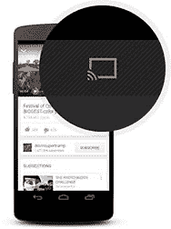

# 谷歌向所有开发者开放 chrome cast 

> 原文：<https://web.archive.org/web/http://techcrunch.com/2014/02/03/google-opens-chromecast-to-all-developers/>

# 谷歌向所有开发者开放 Chromecast

当谷歌[推出](https://web.archive.org/web/20230210080424/https://techcrunch.com/2013/07/24/google-chromecast/)其 [Chromecast](https://web.archive.org/web/20230210080424/http://www.google.com/intl/en-US/chrome/devices/chromecast/) HDMI 加密狗时，它只允许一小部分开发者为其开发应用程序。不过，该公司一直承诺，它将很快向所有开发者开放该平台。今天，[正在做这件事。](https://web.archive.org/web/20230210080424/http://chrome.blogspot.com/2014/02/chromecast-is-now-open-to-developers.html)

此举为 Chromecast 开辟了一系列新的应用。到目前为止，除非你想看网飞、Hulu Plus、YouTube、Pandora 和其他一些应用程序，否则你运气不好。现在，Spotify、脸书、Twitter 或任何其他应用程序没有理由不为 Chromecast 增加一些支持。

开发者现在可以下载 [Google Cast 软件开发工具包](https://web.archive.org/web/20230210080424/https://developers.google.com/cast/)，并在他们的应用和网站中构建 Chromecast 支持[。该公司表示，集成 SDK 很“简单”。不过，开发人员必须支付 5 美元的注册费，这使他们能够访问 Google Cast SDK 开发人员控制台，以便他们可以注册他们的应用程序并授权设备进行测试。](https://web.archive.org/web/20230210080424/https://developers.google.com/cast/docs/downloads)

媒体应用可以只使用默认的 Chromecast 媒体播放器来播放 HTML5 媒体内容，或者他们可以使用自己的品牌定制播放器。对于其他应用程序，开发人员可以创建自己的定制接收器应用程序，支持 MPEG-DASH、HLS 和微软 Smooth Streaming 等标准流媒体协议。为了帮助开发者入门，谷歌还在 GitHub 上提供了一组示例应用[。](https://web.archive.org/web/20230210080424/https://github.com/googlecast/)