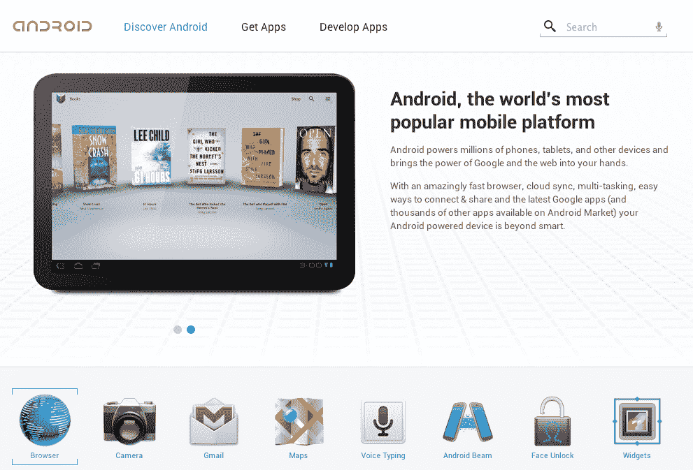

# 谷歌全面改革 Android.com，关注消费者友好度 

> 原文：<https://web.archive.org/web/http://techcrunch.com/2011/11/17/google-overhauls-android-com-with-a-focus-on-consumer-friendliness/>

# 谷歌在消费者友好度上超越 Android.com

安卓在成长。这个平台最初是为反对 iPhone 的人群打造的，现在正迅速演变成为所有人打造的平台。如今，谷歌已经彻底改造了 Android 的网站，以与之相匹配。

从我记事起，【Android.com】就一直是，*干*了。它主要是作为媒体、合作伙伴和开发者的登陆平台而建造的，并没有真正对 Android 的销售做出什么贡献。即使是通用的“了解更多！”链接指向一个充满了完全不友好的术语和短语的页面，比如“添加 SDK 组件”和“API 差异报告”。旧的布局看起来像是 90 年代末遗留下来的东西，这也没有帮助。

虽然它仍然有一两个面向迷失的开发者的链接，但新的 Android.com 将体验浓缩到了最重要的东西:Android。想了解 Android 4.0 的新特性吗？嘭！是[前中](https://web.archive.org/web/20230205013212/http://www.android.com/about/ice-cream-sandwich/)。想要深入了解 Android 的一些更好的功能吗？一键之隔[。](https://web.archive.org/web/20230205013212/http://www.android.com/about/)

新的外观有了显著的改进——或者，如果我们在这里追求客观性的话，显著地更加现代。这里明显强调了大图标和大量的空白空间，让整个页面看起来像是一家大型科技公司发布的主要产品的页面。它超级华丽，没有 Flash——据我所知，所有时髦的动画和过渡都是用 HTML5 和 Javascript 完成的。请务必将鼠标悬停在主屏幕上的手机/平板电脑上，以微妙地展示谷歌坚如磐石的脚本天赋。

谷歌还建立了一个“获取应用”页面，突出显示了一系列主题“捆绑包”中的少数应用，从“平板电脑入门”到“呼叫所有游戏玩家”。谷歌不能说安卓有最多的应用，所以他们有这个页面来宣传他们市场的多样性。

总的来说，这是一个巨大的进步。

