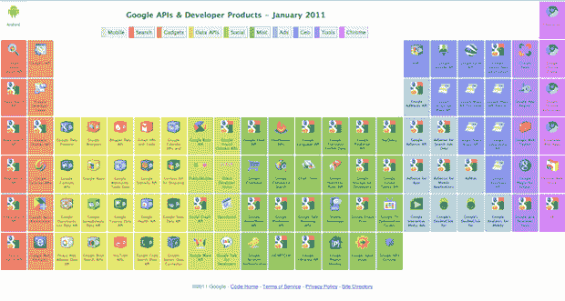

# 俏皮:谷歌的元素 API 周期表 TechCrunch

> 原文：<https://web.archive.org/web/http://techcrunch.com/2011/01/26/google-periodic-table/>

# Nifty: Google 的元素 API 周期表

谷歌是一个庞然大物。他们是一个拥有大量 API 的庞然大物，全球数百万开发者使用这些 API 来构建数百万个应用和服务。根本没有什么好方法来跟踪它们。但是谷歌有一个非常好的方法:周期表。

正如你在页面上看到的[，谷歌有一个完整的周期表，展示了截至 2011 年 1 月的 API 和开发者产品。](https://web.archive.org/web/20230202234858/http://code.google.com/more/table/)

顶部是 API 或产品所属的各种类别。包括:移动、搜索、小工具、数据 API、社交、杂项、广告、地理、工具和 Chrome。将鼠标悬停在其中任何一项上，都会突出显示其下方表格中相应的“元素”。然后你可以点击任何一个元素，它会带你到那个 API 或者产品的页面。

又来了，俏皮。而且有用。