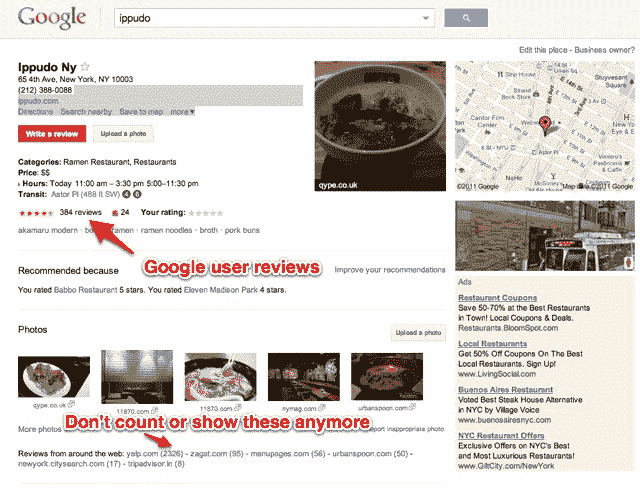

# Google Places 停止窃取评论 TechCrunch

> 原文：<https://web.archive.org/web/http://techcrunch.com/2011/07/21/google-places-stops-stealing-reviews/>

Google Places 看起来不一样。它更干净，更注重用户评论和照片。不仅仅是网络上的评论，还有谷歌用户自己写的评论。对于像 Yelp 和 TripAdviser 这样的第三方评论来源来说，这应该是一个受欢迎的变化，他们长期以来一直抱怨谷歌在他们的内容的[背面建立 Google Places，同时试图取代它们。](https://web.archive.org/web/20230203144030/https://techcrunch.com/2011/06/01/google-places-borrowing-yelp-iphone-app/)

现在，Google Places 不再在特定地点的 Places 页面上显示这些评论，也不会将它们计入每个地点显示的评论总数中。相反，它分别链接到 Yelp、Zagat 和 Citysearch 等网站的评论，并列出每个网站的总评论数。例如，在剔除非谷歌评论后，T4 Paxti ' s Chicago Pizza 的谷歌位置页面从 1110 条评论增加到 171 条。

那么，为什么会突然有这么大的变化呢？嗯，在使用其他网站的评论作为占位符之后，Google Places 现在似乎有足够多的自己的评论来自立，特别是在[加入火锅](https://web.archive.org/web/20230203144030/https://techcrunch.com/2011/04/08/google-places-hotpot/)之后。它不再需要借用(客气地说)那么多外界的评论了。现在在每个位置页面的顶部有一个大的“写评论”按钮，以鼓励更多的用户产生贡献。

但是可能还有另一个原因:谷歌目前正在接受反垄断审查。Google Places 产品经理 Avni Shah 决定将这个奇怪的法律术语包含在她今天关于这些变化的博客文章中:

> 基于对 Place 页面未来发展方向的深思熟虑，以及我们在过去几个月中听到的反馈，来自其他网络来源的评论片段现在已经从 Place 页面中移除。评分和评论计数仅反映由 Google 用户撰写的内容，作为我们帮助您在网上找到所需内容的持续承诺的一部分，我们将继续提供其他评论网站的链接，以便您可以全面了解全球各地的情况。

他没有提到的是这一切的背景故事。这是另一个花絮。一周前，Yelp 在西方司法部长会议上向一屋子的州司法部长做了一个关于搜索监管问题的报告。该小组成员包括 Yelp 政府事务副总裁文斯·索利托(Vince Sollitto)，以及谷歌律师达纳·瓦格纳(Dana Wagner)和知名反垄断律师加里·雷巴克(Gary Reback)。Yelp 的演讲题目是“谷歌位置:对创新和竞争的威胁。”基本的论点是，谷歌强迫评论网站免费提供内容，然后在搜索中给予他们自己的产品优惠待遇。

谷歌之前的立场是，只要 Yelp 和其他公司不阻止他们的网站进行普通搜索，他们可以自由地这样做，那么谷歌也可以使用 Google Places 中的索引内容。这是一种要么接受要么放弃的方法。现在谷歌似乎改变了态度。

