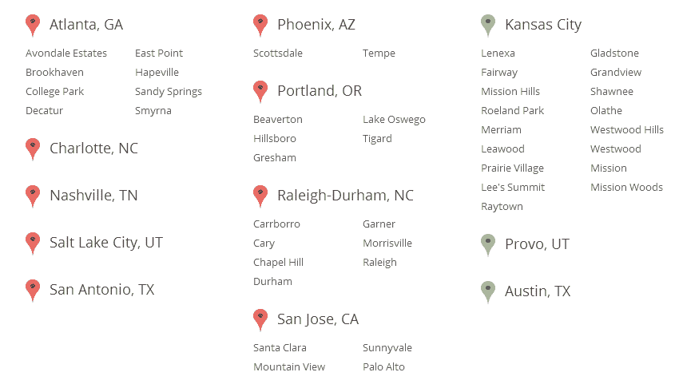

# 谷歌宣布计划将光纤网络扩展到另外 34 个美国城市 

> 原文：<https://web.archive.org/web/https://techcrunch.com/2014/02/19/google-plans-to-expand-fiber-to-34-additional-u-s-cities/>

谷歌今天[宣布](https://web.archive.org/web/20221204184120/http://googleblog.blogspot.com/2014/02/exploring-new-cities-for-google-fiber.html)计划将[谷歌光纤](https://web.archive.org/web/20221204184120/https://fiber.google.com/about/)扩展到[九个大都市地区的 34 个新城市](https://web.archive.org/web/20221204184120/https://fiber.google.com/newcities/)，包括亚特兰大、夏洛特、纳什维尔、凤凰城、波特兰、罗利-达勒姆、圣安东尼奥、盐湖城和圣何塞。该公司表示，它已经邀请这些城市与谷歌合作，“探索如何为他们带来谷歌光纤。”

不过，先别太兴奋。谷歌将在今年年底提供关于哪些城市将真正获得光纤的更新。该公司表示，它将与城市领导密切合作，共同规划光纤网络的细节，并“评估当地可能面临的独特挑战”。谷歌在公告中写道:“虽然我们确实想把光纤带到这些城市中的每一个，但这可能并不适用于所有人。”。

到目前为止，提供快速互联网连接和基于 IP 的有线电视服务的光纤只在堪萨斯城和犹他州的普罗沃可用。谷歌此前也宣布了在不久的将来让德克萨斯州奥斯汀上线的计划，并已经在那里开始建设。

在目前的形式下，谷歌光纤为用户提供了电缆和互联网捆绑服务(每月 120 美元)、非捆绑千兆互联网服务(每月 70 美元)和基本速度的免费互联网服务之间的选择。在谷歌上线的最初几个城市，注册付费计划的用户不必支付任何建设费，而注册免费计划的用户必须支付 300 美元(按月分期付款)才能获得互联网接入。堪萨斯城的用户也收到了一台带有有线电视盒的 Nexus 7，以及谷歌驱动器上的 1tb 存储空间。

到目前为止，谷歌一直坚持这种模式，但不清楚随着它在不同市场的扩张，它是否会改变这种模式。

自从 Fiber [在堪萨斯城推出](https://web.archive.org/web/20221204184120/https://beta.techcrunch.com/2012/07/26/google-details-its-1-gigabit-fiber-network-in-kansas-city-will-come-with-tv-service-1tb-of-cloud-storage-nexus-7/)以来，用户们一直想知道谷歌是否计划将这项服务作为一项实验，或者它是否计划向更广泛的受众推广这项服务。鉴于其在 Provo 和奥斯汀的投资，更大范围的推广似乎总是不可避免的，尽管如此，今天的声明清楚地表明，谷歌对光纤有着宏伟的计划。

