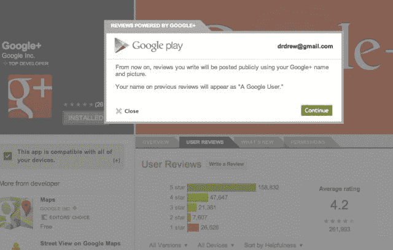
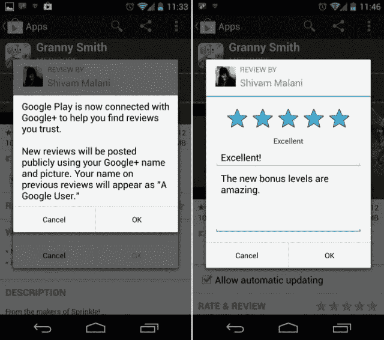
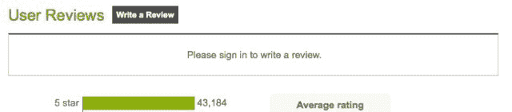

# Google Play 变得真实:评论现在将与您的 Google+名称和图片一起发布 

> 原文：<https://web.archive.org/web/https://techcrunch.com/2012/11/26/google-play-gets-real-reviews-will-now-be-posted-with-your-google-name-and-picture/>

# Google Play 变得真实:评论将会贴上你的 Google+名字和图片

当你在 Google Play 上访问一个应用程序、书籍、歌曲或电影的评论时，你[将不必担心](https://web.archive.org/web/20221208070534/http://www.theandroidsoul.com/google-profiles-begin-appearing-in-reviews-on-google-play/)是否有人害羞地躲在电脑后面说脏话，因为谷歌现在已经打开开关，显示你的 Google+名称和个人资料图片，以及你添加到商店的所有评论。

我不确定这是世界上最好的东西，100%，因为你没有选择关闭它。我喜欢邀请人们分享他们的想法，如果用户选择的话，还可以加入真实姓名和图片。这样，人们就知道相对于其他匿名的，或许是可疑的评论，他们更愿意相信哪些评论。不过，该公司似乎更看重质量而非数量。

不管怎样，正如我之前所说的，谷歌正在全力推进它的 Plus 计划。同样， [YouTube 最近开始了这种转变](https://web.archive.org/web/20221208070534/https://beta.techcrunch.com/2012/06/29/youtube-and-google-grow-closer-all-users-can-now-switch-their-usernames-to-their-google-profiles/)。Play 的这一新举措适用于网络和移动评论。

注销了吗？不好的消息:

请注意，上面写着“评论由 Google+提供支持”，这表明谷歌在所有产品的社交化方面已经走了多远。这不是一个短期项目，而是公司的长期发展。那些祈祷谷歌“失败”的人是孤陋寡闻的专家，因为这不是脸书的竞争对手，而是谷歌产品组合方式的转变。它只是工作。说到脸书，它自己的应用程序中心也依赖真实身份，所以让我们称之为一种趋势。

苹果的应用商店有一个用户名系统，这使得发表尖锐的评论几乎成了一项运动。我可以把这看作是谷歌邀请开发者与他们的用户进行更多互动的一种方式，而不是像大多数开发者在苹果版本上所做的那样，根本不在乎评论。苹果的社交化尝试失败了。平，有人吗？Google+可能会让 Google Play 活跃起来。也许吧。请记住，如果你使用谷歌产品，你已经有一个个人资料。

匿名在网络上死了吗？如果是这样的话，有些人会拍手称快。我发现，那些被允许隐藏在假名和虚拟身份后面的人，在很大程度上往往是最大的混蛋。这并不是说每个喜欢匿名的人都是混蛋，但你明白我的意思。如果没有，那就再读一遍。

混蛋喜欢匿名。非怪人不介意做自己。谷歌已经选择了一方。太二进制？我们会看到的。网络问责万岁。

[图片来源: [Flickr](https://web.archive.org/web/20221208070534/http://www.flickr.com/photos/sahlgoode/4639229188/sizes/z/)