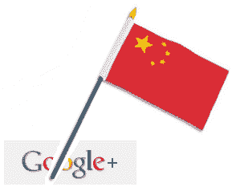

# 中国已经在屏蔽 Google+ | TechCrunch 了

> 原文：<https://web.archive.org/web/https://techcrunch.com/2011/06/29/google-plus-china-blocked/>

# 中国已经在屏蔽 Google+

那没花多长时间。许多人甚至还没有进入 [Google+](https://web.archive.org/web/20230406185758/http://www.crunchbase.com/product/google) [现场试验](https://web.archive.org/web/20230406185758/https://techcrunch.com/2011/06/28/google-plus/)，但这并没有阻止中国当局阻止谷歌全新的[社交网络项目](https://web.archive.org/web/20230406185758/https://techcrunch.com/2011/06/29/google-plus-is-actually-pretty-good/)，报道 [Ren Media](https://web.archive.org/web/20230406185758/http://www.renmedia.co.uk/news/china-blocks-google-plus) 。

的确， [Just Ping](https://web.archive.org/web/20230406185758/http://www.just-ping.com/index.php?vh=plus.google.com&c=&s=ping%21) 和[Greatfirewallofchina.org](https://web.archive.org/web/20230406185758/http://www.greatfirewallofchina.org/index.php?siteurl=plus.google.com)网站都确认了[plus.google.com](https://web.archive.org/web/20230406185758/http://plus.google.com/)无法从 mainland China 访问。

审查本身并不令人惊讶；中国当局对美国社交网络不太感兴趣，并封锁了脸书、推特、YouTube 和 Foursquare 等服务。

尽管如此，我还是对中国对 Google+正式亮相的迅速反应感到吃惊，在进一步通知之前，Google+是一个只有受邀才能参加的测试产品(尽管，不可否认的是，在过去的 24 小时里，它受到了许多国际媒体的关注)。

**更新:** Penn-Olson [表示](https://web.archive.org/web/20230406185758/http://www.penn-olson.com/2011/06/30/google-plus-china/) Google+并没有被屏蔽，只是通过将它的运行速度减慢到一个爬行的速度而变得无法使用，这本质上归结为一件事:审查。