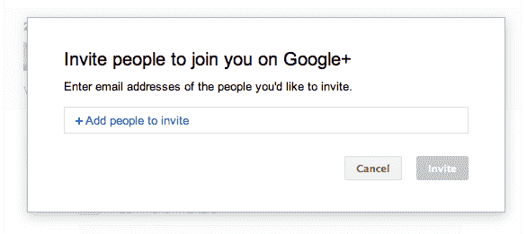

# 观看 Twitter 爆炸:Google+邀请早期用户 TechCrunch

> 原文：<https://web.archive.org/web/https://techcrunch.com/2011/06/29/google-plus-invites/>

# 观看 Twitter 爆炸:Google+邀请授予早期用户

如果有一个问题我不止被问到“你收到 Google+的邀请了吗？”，记不清了。[才过了一天](https://web.archive.org/web/20230201041429/https://techcrunch.com/2011/06/28/google-plus/)！遗憾的是，我没有收到任何邀请。谷歌已经决定他们将非常缓慢地推出网络。

或者说*是*的计划。

现在看来，早期的 Google+用户(指昨天刚刚获得访问权限的用户)现在可以选择邀请其他人。据我所知，它是无限的。

我意识到贴这个，我真的是自找的。大口喝。

一个很大的警告:我不知道这些邀请是否允许立即访问，或者它们只是你添加你想要获得邀请的朋友的一种方式——然后他们会被添加到等待列表中。

**更新**:正如谷歌的布拉德利·霍洛维茨在评论中指出的:

> “谷歌已经决定他们将非常缓慢地推出网络。或者这就是计划。”
> 
> 实际上，这仍然是我们的计划。
> 
> 为了测试产品和收集更多的反馈，我们在现场试验中推出了 Google+。作为实地测试的一部分，我们可能会随时向新用户开放和关闭 Google+。我们很高兴有这么多人对尝试新的在线分享方式感兴趣，但是请考虑:
> 
> –在任何时候，给定的邀请可能会也可能不会授予访问权限。
> –费率限制可能会发生变化。
> –专业提示:群发邀请不是让你爱的人联系你的有效策略。我建议邀请那些你真正想分享的人…

