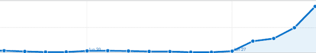

# 如果 Google Buzz 是一个分享流量的黑洞，Google+就是大爆炸 TechCrunch

> 原文：<https://web.archive.org/web/http://techcrunch.com/2011/07/05/google-plus-sharing/>

# 如果 Google Buzz 是一个分享流量的黑洞，Google+就是大爆炸

回到去年 3 月，我们注意到 Google Buzz，当时 Google 闪亮的新社交网络，在推荐流量方面被一个死人 FriendFeed 的[熏到了](https://web.archive.org/web/20230203074430/https://techcrunch.com/2010/03/29/google-buzz-sharing/)。事实证明，谷歌自己的分析服务低估了 Buzz，因为它驻留在 Gmail 中，Gmail 使用 HTTPS 并删除了推荐信息。换句话说，大多数蜂音流量[只能被推断，而看不到](https://web.archive.org/web/20230203074430/https://techcrunch.com/2010/03/29/google-buzz-black-hole/)。然而，在查看了几个月的数据后，我不相信 Buzz [实际上发送了任何数量的有意义的流量。到目前为止新推出的 Google+也并非如此。](https://web.archive.org/web/20230203074430/https://techcrunch.com/2011/04/28/buzz-off-google-buzz/)

是的，到目前为止它才发布了一周(仍然只有非常有限的用户可以使用)，但是根据我们所看到的，这个社交网络已经给我们带来了大量的流量。

多大？嗯，自从上周二推出以来，Google+已经进入了我们的十大推荐网站。目前，它仅次于 Digg。如果你把范围缩小到目前为止的 7 月份(发布后几天，所以更多的用户有时间注册)，数字会更好。它已经是排名第七的推荐网站，仅次于黑客新闻。它已经是领先的社交网站 facebook.com 的五分之一。

但是等等，Google+也使用 HTTPS，所以它不是也被错误地计算了吗？不——谷歌已经从之前的 Buzz 错误中吸取了教训(并借鉴了脸书的经验)，现在通过一个不安全的 google.com 地址重定向所有出站链接以获取流量。[正如路易斯·格雷几天前指出的那样](https://web.archive.org/web/20230203074430/http://blog.louisgray.com/2011/07/google-referral-traffic-possible-to.html)，你应该在你的日志中寻找的网址是"http://www.google.com/url？sa=z”后跟唯一的内容代码。如果你点击来自 G+的任何外部链接并快速查看，你会看到这些网址在地址栏中闪烁。

考虑到我们还没有正式使用它来分享链接，我们从 Google+看到的入站流量是相当疯狂的。在脸书和推特上，我们向我们的关注者发送链接，这导致了大部分的点击量(无论是直接点击还是转发)。在 Google+上，我们还没有做任何事情，这一切都发生在其他人有机地分享我们的链接。

其他出版物肯定也注意到了同样的事情，因为它们已经为 Google+建立了官方账户，扎克·苏厄德在这里指出。上周，我们联系了谷歌，想做同样的事情，但他们告诉我们“它还没有完全为商业做好准备”。他们还向我们指出了他们的政策措辞，即任何注册 Google+的人都必须使用真实姓名。目前看来，谷歌仍在探索处理这种大规模共享的最佳方式。

在我们指出这些用企业名称注册的其他人之后，他们确认他们现在不会禁止任何人这样做，但警告说如果我们真的建立了一个，一旦 Google+for business 准备就绪，我们就必须建立一个新的个人资料。但是谁知道那会是什么时候呢？似乎出版商的这个早期机会是你不能袖手旁观的。虽然 G+ [可能被认为不仅仅是一个链接共享服务，但现在很多人使用它就是为了这个。正在进行的重新分享是巨大的。](https://web.archive.org/web/20230203074430/https://techcrunch.com/2011/06/29/google-plus-circles/)

对于出版商来说，Google Buzz 过去是、现在仍然是一个黑洞。但是 Google+是一个大爆炸。

