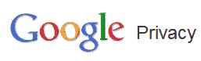
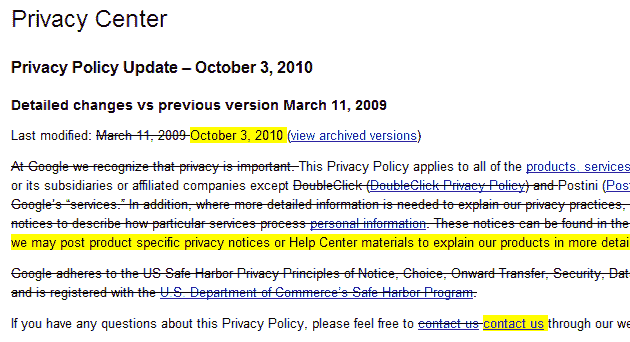

# 谷歌将更新、缩短和消除隐私政策的行话——以下是正在发生的变化

> 原文：<https://web.archive.org/web/https://techcrunch.com/2010/09/03/google-privacy-policy-update/>

# 谷歌将更新、缩短和去行话隐私政策——以下是正在发生的变化

谷歌副总法律顾问杨洋刚刚[在](https://web.archive.org/web/20230210093631/http://googleblog.blogspot.com/2010/09/trimming-our-privacy-policies.html)的谷歌博客上发表了一篇文章，告知用户该公司正在缩短其隐私政策，让非律师人士更容易理解。他们还做了一些其他的改变，但要明确的是，山景城公司并没有改变其隐私做法。

这些更新将于 10 月 3 日生效，也就是 30 天后。

在此之前，所有产品和服务将继续受当前版本的隐私政策管辖，谷歌将通过[谷歌隐私中心](https://web.archive.org/web/20230210093631/http://www.google.com/privacy)向人们更新这些变化，并在谷歌账户登录页面上发布通知，使人们能够在登录 Gmail、Docs、Talk 或 Calendar 时了解这些变化。

隐私中心现在也有一个[专用页面](https://web.archive.org/web/20230210093631/http://www.google.com/intl/en/privacy_tools.html)，用户可以在这里找到最流行的隐私工具，随着时间的推移，谷歌的一些产品帮助中心将获得更多内容。

那么还有什么在改变呢？

大多数谷歌产品和服务都受主要的谷歌隐私政策管辖，该政策最近一次更新是在 2009 年 3 月。然而，谷歌写道，它的一些产品也有个人隐私政策。

该公司将取消其中 12 项特定于产品的政策，以减少不必要的冗余和/或更好地反映产品如何协同工作。这 12 种产品将继续受主要的谷歌隐私政策管辖。

它们是:3D 仓库、应用引擎、日历、文档、火狐扩展、G1、Gmail、反馈、iGoogle、地图、对话和任务。

谷歌的主要隐私政策也将变得更加用户友好。

谷歌表示，它正在削减冗余，并更新一些法律语言，以使用户更加清楚。例如，谷歌将删除一句话，“我们提供服务的附属网站可能有不同的隐私做法，我们鼓励你阅读他们的隐私政策，”因为他们意识到，非谷歌网站显然不受谷歌隐私政策的保护。

您可以看到将于 2010 年 10 月 3 日生效的更新政策的[预览图](https://web.archive.org/web/20230210093631/http://www.google.com/intl/en/privacypolicy_2010.html)。但是更好的是去[这一页](https://web.archive.org/web/20230210093631/http://www.google.com/intl/en/privacy_changes_2010.html)，在这里所有的变化都显示得更清楚。

