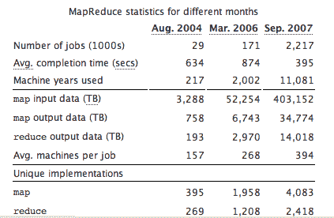

# 谷歌每天处理 20，000 兆字节，并且还在增长

> 原文：<https://web.archive.org/web/https://techcrunch.com/2008/01/09/google-processing-20000-terabytes-a-day-and-growing/>

# 谷歌每天处理 20，000 兆兆字节，并且还在增长

 最近由一些谷歌工程师撰写的[白皮书](https://web.archive.org/web/20230306013449/http://portal.acm.org/citation.cfm?doid=1327452.1327492)对谷歌每天进行的大量计算给出了一些数字，这些计算包括网页索引、处理搜索结果、提供广告等。截至去年 9 月，谷歌每天处理 20，000 万亿字节的数据。这种大规模计算能力是谷歌相对于雅虎、微软和其他所有公司的竞争优势的一大部分。

Niall Kennedy 报告了谷歌大规模计算增长的详细情况，并估计每个大规模计算工作(即 MapReduce)的硬件成本约为 100 万美元。2004 年至 2006 年间，这类工作的数量增长了近一个数量级(10 倍)，一年半后又增长了一个数量级。请参见下图:

