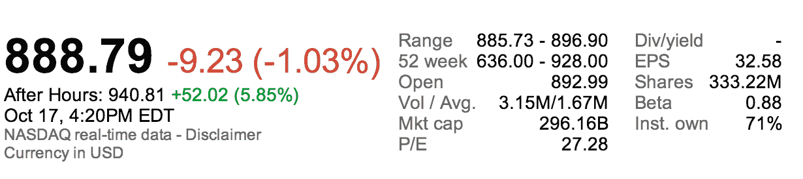

# 谷歌在第三季度以 148.9 亿美元的收入、29.7 亿美元的净收入和 10.74 美元的每股收益击败华尔街

> 原文：<https://web.archive.org/web/https://techcrunch.com/2013/10/17/google-q3-2013-earnings/>

# 谷歌在第三季度以 148.9 亿美元的收入、29.7 亿美元的净收入和 10.74 美元的每股收益击败华尔街

谷歌 2013 年第三季度的收益报告刚刚出炉，比预期的要好。该公司报告称，在过去三个月中，它产生了 148.9 亿美元的合并收入和 29.7 亿美元的净收入，以及每股 10.74 美元的非 GAAP 收益。

据雅虎财经报道，分析师预计该公司本季度收入约为 148 亿美元，每股收益为 10.35 美元。幸运的是，对于搜索和广告巨头来说，这是上个季度的一个巨大变化。该公司在最后一轮中未能达到华尔街的每股收益和收入预期[。](https://web.archive.org/web/20221209020653/https://beta.techcrunch.com/2013/07/18/google-misses-estimates-in-q2-with-14-1b-in-revenue-net-income-of-3-2b-and-eps-of-9-56/)

投资者已经对这一消息做出了反应:谷歌的股价在收盘时为 1%，但在撰写本文时，其股价在盘后交易中飙升了近 6%。

很多人都在关注谷歌的广告业务，尤其是该公司的每次点击成本。在线营销公司 The Search Agency 前几天报告说，它看到谷歌的每次点击成本在上升，注意到上一季度上升了 3.5%。谷歌的新报告指出了一些不同的东西——具体来说，它看起来像是 CPC 连续下降了 8%，与去年同期相比下降了 4%。这不完全是该公司希望继续的那种趋势，因为在 Q2，每次点击成本连续下降了 6%。

未来几周，广告业务将变得有点奇怪:谷歌宣布，它将利用其 Google+用户的照片和背书，为一些广告增加额外的个人可信度。尽管如此，谷歌的增强活动(允许广告商设计一个可以在多种类型的设备上部署的单一广告活动)应该有助于该公司巩固其在移动领域的地位。与此同时，谷歌的付费点击量同比增长 26%，比上一季度增长 8%。

本季度，谷歌在硬件方面也变得更加大胆——其摩托罗拉移动子公司发布了可定制的 Moto X，获得了普遍积极的评价，而令人好奇的 35 美元 Chromecast 加密狗几乎立即飙升至亚马逊销售排行榜的首位。如果说有什么不同的话，那就是前者更令人感兴趣，因为摩托罗拉部门在过去几个季度连续亏损，并大幅裁员以削减成本。目前，摩托罗拉的员工数量似乎保持稳定，但该部门仅获得 11.8 亿美元的收入(或总收入的 8%)，并报告了可观的 2.48 亿美元的运营亏损。

这是一个发展中的故事，请刷新更新。