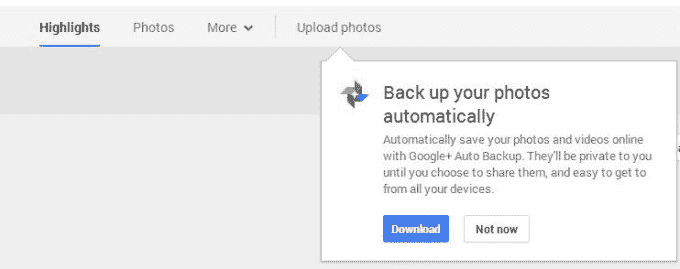
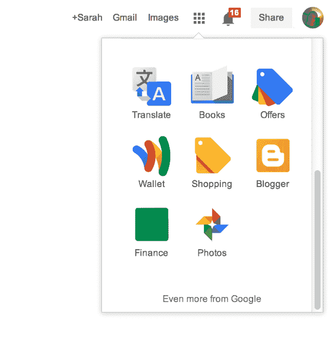

# 谷歌悄然开始向 Google+用户推广其照片备份软件 TechCrunch

> 原文：<https://web.archive.org/web/https://techcrunch.com/2014/02/25/google-quietly-begins-pushing-its-photo-backup-software-to-google-users/>

谷歌已经开始通过该公司的社交网络平台 Google+向 Mac 和 Windows 用户推广其“自动备份”照片存档软件。我们已经证实，这次促销是新的，尽管软件本身是在 12 月份首次推出的。

那时，[谷歌开始提供](https://web.archive.org/web/20221207012653/http://9to5mac.com/2013/12/29/google-launches-new-google-auto-backup-utility-for-mac-with-latest-picasa-update/)桌面工具，作为其旧的 Picasa 照片共享平台的一部分，令人困惑(也很奇怪)的是，尽管谷歌一直在将 Google+集成到它拥有的一切中，从搜索到 Gmail 到 YouTube。当 Picasa 的 Mac 和 Windows 版本在去年年底推出时，出现了一个名为“自动备份”的独立工具。这个应用程序在后台运行，类似于 Google Drive 或 Google Music 之类的东西，以便将你的所有照片上传到 Google+，包括 SD 卡中的照片。

现在，一些用户[注意到](https://web.archive.org/web/20221207012653/https://plus.google.com/u/0/+SeanSaguansin/posts/Uqvczsxr3FE)当他们点击社交网站的“照片”部分时，Google+上出现了相同软件的链接。

该提示出现在 Google+照片顶层导航的“上传照片”按钮下方。在这里，一个对话框解释说，该软件会自动将你的照片和视频保存到 Google+，在那里它们会被标记为私有，除非你选择分享它们。如果你是 Chrome 用户，点击应用程序启动器中的“照片”图标(右上角的方形网格按钮)，你也可以访问 Google+ Photos，然后看到这个提示。

我发现，当你下载了这个工具，或者用另一种方式消除了这个提示之后，可能很难让这个消息再次出现。Google+上似乎没有一个网站或版块可以让用户找到直接为自己下载这款软件的链接。例如，Google+Photos“[游览”页面](https://web.archive.org/web/20221207012653/https://plus.google.com/u/0/photos/takeatour)指向 Google Play 和 iTunes 应用商店上的“自动备份”应用程序(实际上只是 Google+应用程序)，但在 Mac 和 Windows 上却找不到“自动备份”的链接。

不管怎样，如果你决定利用这个工具，请注意它不会考虑你计算机上的文件夹结构。也就是说，它会从你指向的所有相册中取出照片，并将它们放在 Google+上的一个相册中，然后你可以选择分享或组织它们。

当然，就谷歌关闭 Picasa 品牌和域名的更大计划而言，该软件的出现意味着什么还有待观察。不管出于什么原因，谷歌继续开发和[更新](https://web.archive.org/web/20221207012653/https://support.google.com/picasa/answer/53209)其 Picasa 桌面软件，尽管它在功能集(照片编辑、组织等)方面与 Google+存在竞争。)和 mindshare。

图片致谢:我…哦和 [Sean Saguansin](https://web.archive.org/web/20221207012653/https://plus.google.com/u/0/+SeanSaguansin/posts/Uqvczsxr3FE) 在 Google+上因为我没有抓取这部分的截图！