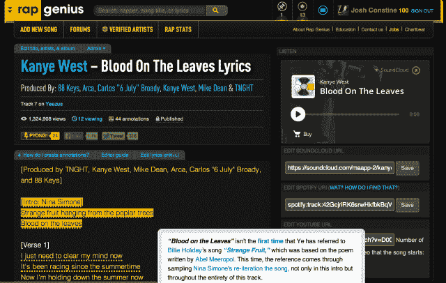
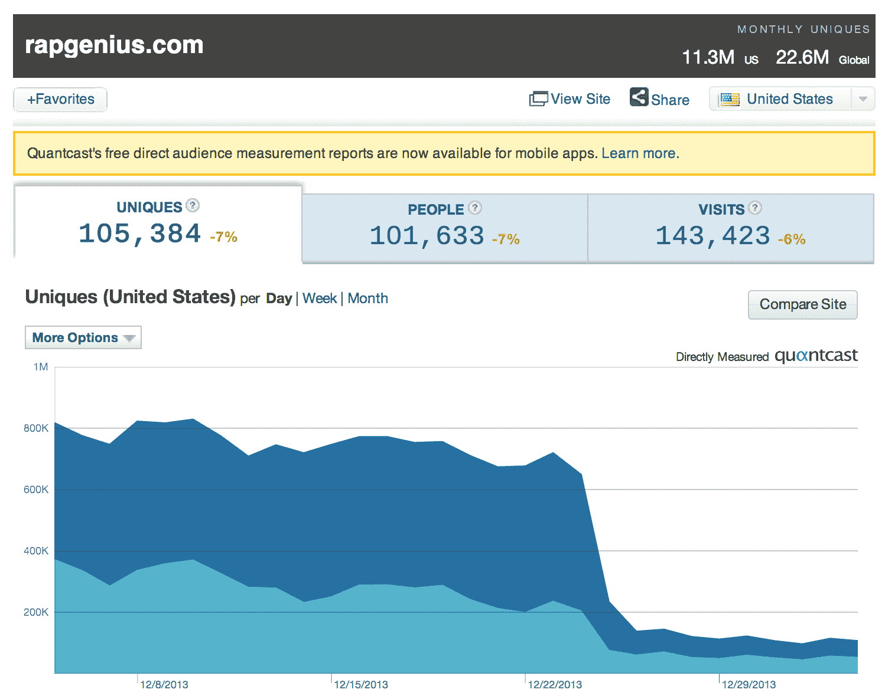
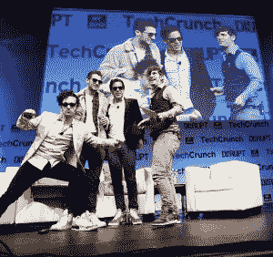
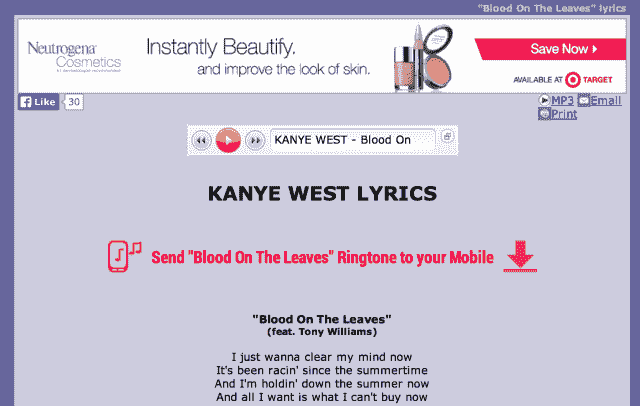

# 谷歌将 Rap Genius 重新放在搜索结果的首位，更青睐智能结果而不是心怀怨恨

> 原文：<https://web.archive.org/web/http://techcrunch.com/2014/01/04/google-rap-genius-seo/>

谷歌显然更关心给出最好的搜索结果，而不是惩罚垃圾信息发送者，因为它正在恢复歌词网站[说唱天才](https://web.archive.org/web/20230327195359/http://rapgenius.com/) 在 10 天前因 SEO 垃圾信息被驱逐后的高搜索排名。看起来像是对说唱天才流量的死刑判决已经变成了轻微的惩罚。[今天，说唱天才详细说明了](https://web.archive.org/web/20230327195359/http://news.rapgenius.com/Rap-genius-founders-rap-genius-is-back-on-google-lyrics)它做错了什么，以及它如何丢弃垃圾链接，重新赢得谷歌的青睐。

《说唱天才的搜索引擎优化失误》前情提要，这家初创公司[已经从安德森·霍洛维茨](https://web.archive.org/web/20230327195359/https://techcrunch.com/2012/10/03/rap-genius-andreessen-horowitz/)那里筹集了 1500 万美元来注释网络。它的网站包含歌词、宗教文本、法律文件、诗歌和新闻，并允许用户添加对其含义的解释。说唱天才的创始人被称为[自吹自擂的煽动者](https://web.archive.org/web/20230327195359/https://techcrunch.com/2013/05/01/rap-genius-co-founder-apologizes-to-zuck-then-says-theyll-be-bigger-than-facebook/)，他们在 TechCrunch Disrupt New York 接受我采访时展示了他们的荒谬。在那里，他们讨论了裸体时服用像 Adderall 这样的研究药物，以确保他们呆在家里，专注于网站的建设。

Rap Genius 稳步上升到许多搜索结果页面的顶部，这要归功于博客作者的链接和风险投资，因此它不必显示像激进的弹出窗口和铃声诈骗这样的广告，这些广告污染了 AZlyrics 和 MetroLyrics 等竞争对手的歌词网站。

但在一次粗略的失败尝试中，Rap Genius 启动了“Rap Genius 博客联盟”计划，该计划将通过社交媒体推广任何人的博客帖子，作为交换，博客作者将 Rap Genius 歌词的链接插入到他们的帖子中。例如，它要求电子邮件过滤初创公司创始人约翰·马巴赫(John Marbach)为贾斯汀比伯的所有新歌添加 Rap Genius 页面的链接，希望借此登上比伯歌词搜索的榜首。

问题在于，谷歌禁止网站通过将链接添加到不相关的网页和博客帖子上来利用其搜索引擎排名算法——这正是 Rap Genius 所做的。马巴赫公布了说唱天才发给他的指令，这给谷歌的搜索垃圾沙皇马特·卡茨通风报信，他说他的团队[会调查](https://web.archive.org/web/20230327195359/https://news.ycombinator.com/item?id=6957463)。

尽管说唱天才[道歉](https://web.archive.org/web/20230327195359/http://news.rapgenius.com/Rap-genius-founders-open-letter-to-google-about-rap-genius-seo-lyrics)，我们详细描述了[谷歌如何破坏说唱天才的搜索引擎结果页面排名](https://web.archive.org/web/20230327195359/https://techcrunch.com/2013/12/25/google-rap-genius/)，将它们隐藏在歌词搜索甚至“说唱天才”搜索结果的第五或第六页，而这些搜索结果曾经排名很高。圣诞节实施的惩罚对说唱天才的流量产生了毁灭性的影响，因为大量的流量来自谷歌搜索。Quantcast 表示，说唱天才从每天大约 70 万首单曲下降到大约 10 万首。

当时，说唱天才告诉 TechCrunch,“我们正在与谷歌合作解决这个问题……我们正在尽快解决这个问题，希望很快就能回到谷歌。”

谈判似乎进展顺利，因为今天[说唱天才宣布](https://web.archive.org/web/20230327195359/http://news.rapgenius.com/Rap-genius-founders-rap-genius-is-back-on-google-lyrics)“说唱天才重返谷歌。恢复正常需要几天时间，但我们正式回来了！首先，我们非常感谢谷歌的公平和透明，让我们回到他们的结果页面。”

在其冗长的博客文章中，Rap Genius 解释了它最初是如何请求音乐博主在适当的时候链接到它的。但随后，创始人马哈茂德·莫格达姆、汤姆·雷曼和伊兰·泽乔里承认“我们越界了，我们活该被打”，指的是可疑的博客联盟计划。“我们向谷歌和我们的粉丝道歉，因为他们是这样的白痴”，他们写道，表明他们肯定不是来自 [Snapchat“永不说抱歉”的危机管理学校](https://web.archive.org/web/20230327195359/https://techcrunch.com/2014/01/02/snapchat-says-its-improving-its-app-service-to-prevent-future-leaks/)。

Rap Genius 继续详细描述了它是如何重返谷歌的。作为惩罚，搜索引擎已经发布了一个“手动操作”，直接操纵搜索结果来推送 Rap Genius 的网址。原因是“指向你网站的非自然链接”，谷歌解释为“指向你网站的非自然的人工、欺骗性或操纵性链接的模式。”

为了解决这个问题，Rap Genius 不得不删除所有垃圾链接，标记为“nofollow ”,或者否认。但是有成千上万的链接散布在网络上。于是 Rap Genius 联系了它认识的站长，建了一个刮刀来找剩下的链接。那些它无法删除或标记为“nofollow”的内容被输入到谷歌的否认工具中，以防止它们影响搜索结果排名。

为了证明为什么一群喜欢让马克·扎克伯格这样的科技名人给他们口交的吵闹的耶鲁人从安德森那里获得了 1500 万美元，说唱天才详细介绍了它是如何建造一个高效的平行刮刀的。借助 Nokogiri、堤福俄斯、Heroku 等工具，以及一些严肃的黑客技术，它创建了一个刮刀，仅用 15 分钟就找到了所有链接。帖子中包含的代码片段和技术细节肯定是为了提高 Rap Genius 在它可能试图雇佣的工程师中的地位。

最终，它获取了超过 177，000 个 URL 来查找、修复或删除指向其网站的垃圾链接。显然，这足以让谷歌恢复其搜索引擎优化的地位。

当然，Rap Genius 得到了硅谷最强大、人脉最广的风险投资公司之一安德里森·霍洛维茨(T2)的资助，这可能不会有什么坏处。一家没有这些优势的创业公司可能不会轻易脱身，有些人可能会认为这是谷歌的偏袒。

我们将回头看看 rap genius 是否恢复了所有的 SEO 活力，或者有任何挥之不去的惩罚，但 Rap Genius 的网站现在是“Rap Genius”搜索的[顶级结果](https://web.archive.org/web/20230327195359/https://www.google.com/search?q=rap+genius&oq=rap+genius&aqs=chrome.0.69i59l3j69i60l3.1779j0j1&sourceid=chrome&espv=210&es_sm=91&ie=UTF-8)，它也再次出现在搜索的顶级结果中，如[“Kanye West Blood On The Leaves Lyrics”](https://web.archive.org/web/20230327195359/https://www.google.com/search?q=kanye+west+blood+on+the+leaves+lyrics&oq=kanye+west+blood+on+the+leaves+lyrics&aqs=chrome..69i57j69i60l3.281j0j1&sourceid=chrome&espv=210&es_sm=91&ie=UTF-8)。Rap Genius 还计划在下周发布一款 iOS 应用，试图摆脱对谷歌的依赖。

Rap Genius 的竞争对手 AZLyrics 的特色是广告欺诈和内容贫乏

最终，谷歌会把用户放在第一位。尽管说唱天才的策略可能令人遗憾，但他们提供了比大多数竞争对手更好的歌词网站体验。像 AZlyrics 和 Metrolyrics 这样的网站覆盖着每月 9.99 美元铃声订阅的诈骗广告，并被怀疑也从事可疑的 SEO 实践。上面 AZLyrics 的截图中并没有音乐播放器，这是一个欺骗性的另一个网站链接。

同时，Rap Genius 提供准确的歌词以及歌词含义的解释，以便您可以解码晦涩的隐喻。它还提供 SoundCloud 嵌入程序，这样你就可以听到歌曲、YouTube 和 Spotify 的链接，甚至是关于歌曲样本来源的注释。

谷歌本可以把说唱天才关在搜索排名地牢里，但这只会让用户访问更差的网站，这与谷歌“组织世界信息并使其普遍可用”的使命不符

*更多关于说唱天才的荒谬，请看:*

[当增长黑客变坏](https://web.archive.org/web/20230327195359/https://techcrunch.com/2014/01/03/when-growth-hacking-goes-bad/)

[谷歌摧毁说唱天才的搜索排名作为对搜索引擎优化垃圾的惩罚](https://web.archive.org/web/20230327195359/https://techcrunch.com/2013/12/25/google-rap-genius/)

扰乱舞台视频:说唱天才的联合创始人向扎克道歉(然后说他们会比脸书更伟大)

[视频采访:本·霍洛维茨和创始人解释为什么 A16Z 向说唱天才投资 1500 万美元](https://web.archive.org/web/20230327195359/https://techcrunch.com/2012/10/03/rap-genius-andreessen-horowitz/)

[说唱天才正在和新闻天才一起进行突发新闻分析](https://web.archive.org/web/20230327195359/https://techcrunch.com/2013/05/01/rap-genius-news-genius/)

[Rap Genius 揭示其商业模式之一将是“企业天才”协作工具](https://web.archive.org/web/20230327195359/https://techcrunch.com/2013/05/01/rap-genius-enterprise/)