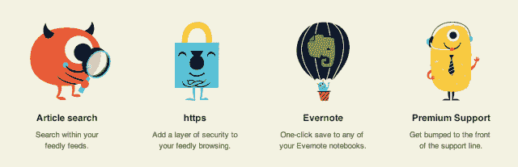

# Google Reader Alternative Feedly 出售新推出的专业账户，今年秋天会有更多

> 原文：<https://web.archive.org/web/https://techcrunch.com/2013/08/05/google-reader-alternative-feedly-sells-out-of-newly-launched-pro-accounts-more-arriving-this-fall/>

在 Google Reader replacement Feedly[开始向](https://web.archive.org/web/20230128194604/http://www.engadget.com/2013/08/05/feedly-pro-subscription/)提供付费版服务仅仅一天后，该公司已经售罄了其提供的有限数量的付费账户。Feedly 的联合创始人 Edwin Khodabakchian 和 Cyril Moutran 表示，他们在周末引入了 5000 个 Pro 账户，以测试该公司优质产品的早期版本，该产品引入了安全浏览、Evernote 集成、优先客户服务以及最重要的搜索功能。

文章搜索是 Feedly 最受期待的功能之一，Feedly 目前正在与包括 Digg Reader 和 Newsblur 在内的许多替代产品竞争，所有这些产品的用户数量在谷歌阅读器关闭后都有所增长。

Feedly 没有宣传 Pro 版本，Moutran 将其描述为目前的“v1”产品。相反，该公司允许其最活跃的用户在更大规模、更公开的发布之前注册。然而，当[网站 Engadget 在周日发现](https://web.archive.org/web/20230128194604/http://www.engadget.com/2013/08/05/feedly-pro-subscription/)这一新增功能时，消息就传开了，这有助于将注意力吸引到 Feedly Pro 的首次亮相上。

“它的销售速度比我们想象的要快得多，”Moutran 说，他补充说，用户来自世界各地，包括巴西、法国、西班牙、德国、英国、美国和亚洲部分地区。“我们认为第一批用户将主要在美国，但我们在所有国家都看到了几乎相同的转变，”他告诉我们。

创始人表示，他们只向有限数量的用户推出 Feedly Pro 的原因是，他们计划用 Pro 帐户带来的钱来购买他们需要更广泛地推出 Pro 帐户的硬件——他们估计这是今年 9 月晚些时候计划的事情。

如今，这项服务的用户已经超过 1300 万，现在有 30 个 API 合作伙伴生活在其 Feedly 云平台上，这使得其他新闻阅读产品和应用程序可以利用 Feedly 的后端来实现自己的目的。像 Reeder、Newsify、Mr. Reader、Byline 和其他流行的客户端应用程序今天已经利用了云，其他一些新的应用程序将在未来几周内宣布。

有一件事让人摸不着头脑，那就是 Feedly 是如何独自建立起如此规模的服务的，因为在谷歌阅读器关闭后，如此多的新进入者几乎被蜂拥而至的用户压垮了。答案是，Feedly 在这方面已经做了很长时间。该公司于 2008 年首次推出，这让它比大多数竞争对手领先了几年。值得注意的是，到目前为止，它是由创始人自己掏腰包建立的。收入流的缺乏已经开始让一些人担心，他们想知道 Feedly 是否可以在没有可行的收入流的情况下生存下去。但是公司[在四月](https://web.archive.org/web/20230128194604/https://techcrunch.com/2013/04/01/now-with-3-million-new-users-google-readers-heir-apparent-feedly-relaunches-on-ios-android-reveals-how-it-plans-to-make-money/)告诉我们它计划如何赚钱:通过“免费增值”

这个周末，Feedly 终于开启了它的商业模式(5 美元/月或 45 美元/年——可悲的是，打折的 99 美元/终身账户是一次性交易；未来的终身账户将花费更多。)但即使 Feedly 现在有付费用户，也不代表它不考虑未来筹资。

“机会是围绕意图建立一个阅读平台。过去几年里，围绕休闲阅读开发了许多工具，但很少有工具能达到我们的参与度，”Khodabakchian 说，他补充说，Feedly 的许多用户都是专业人士，他们消费新闻、做研究的医生、追随潮流的设计师等等。

“我们的愿景是创建一个平台，让你能够更有效地消费这些数据，不仅仅是在 Feedly 中，而是在大量不同的应用程序中，”他说。Khodabakchian 指出，肯定有一些外部投资者对此感兴趣。他表示:“我们不排除任何可能性，但只有找到真正与我们的愿景一致的人，我们才会(筹集资金)。”(无关旁注？Feedly [似乎喜欢本·霍洛维茨](https://web.archive.org/web/20230128194604/http://blog.feedly.com/2013/07/20/ben-horowitz/)。)