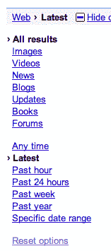
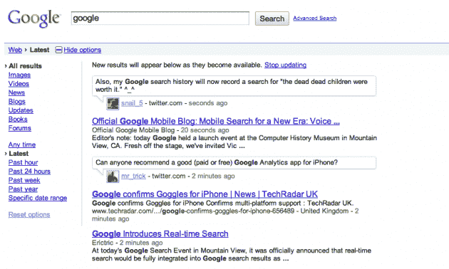
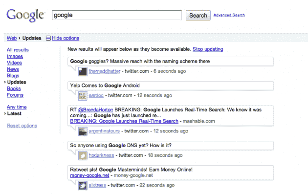
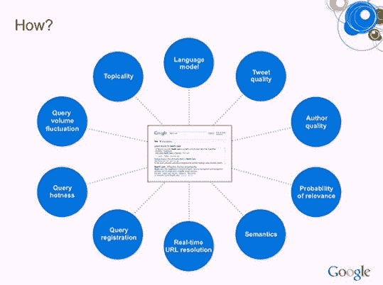

# 谷歌旨在通过实时结果推动光速。说真的。TechCrunch

> 原文：<https://web.archive.org/web/https://techcrunch.com/2009/12/07/google-realtime/>

# 谷歌旨在通过实时结果推动光速。说真的。

今天，在山景城的[搜索活动](https://web.archive.org/web/20230216015231/https://techcrunch.com/2009/12/07/google-search-event/)上，谷歌伙伴[阿密特·辛格哈尔](https://web.archive.org/web/20230216015231/http://www.google.com/corporate/execs.html#amit)(他[最近参加了我们的](https://web.archive.org/web/20230216015231/https://techcrunch.com/2009/11/20/realtime-crunchup-stream-roundtable/)实时运算)上台宣布了搜索巨头的一个新功能:实时。

Singhal 这样描述道:“这是谷歌与实时网络相遇的相关技术。

正如我们在过去几个月中通过推特搜索所了解到的，相关性可能是让实时搜索成为网络支柱的关键。谷歌似乎认为它已经破解了代码，并且已经在内部测试了一段时间。但从今天开始，它将为每个人直播。

辛格哈尔通过对“奥巴马”进行查询来展示新功能结果页面实时显示结果。是的，它与推特合作。例如，谷歌的马特·卡特斯(Matt Cutts)在推特上发布了一些来自观众的信息，并立即出现在结果中。谷歌表示，这是第一次有任何搜索引擎将实时结果整合到标准页面中。显然，这是巨大的。

谷歌将提供实时趋势(看看这些趋势如何与推特趋势相比较将会很有趣)，趋势将于今天正式离开谷歌实验室。这种新的实时搜索将立即在安卓设备和苹果手机上生效。谷歌表示，它每天将查看超过 10 亿份实时文档。这包括推文，博客帖子，还有来自[的信息，比如我的空间](https://web.archive.org/web/20230216015231/https://techcrunch.com/2009/12/07/myspace-google-realtime/)，是的，甚至脸书。其他合作伙伴包括 FriendFeed、Jaiku 和 Indenti.ca。

随着信息量的增长，相关性的重要性已经一飞冲天。辛哈尔指出:“相关性已经成为关键因素。他继续指出，在幕后进行了很多工作，以确保相关性保持完整——包括谷歌显然开发了“几十种”新技术。语言是一个关键的方面(在这方面，实时结果将首先在英语中提供，但在 2010 年 Q1 会议上应该会提供给其他网站)。另一个关键是确定像推文这样的东西是自动发送的还是由某人手动发送的。

当这个上线时(*更新，现在是直播*)，你会在谷歌搜索的“显示选项”侧栏看到一个新的“最新”选项。还有一种过滤结果的方法，只过滤来自 Twitter 之类的状态更新。

“*光可以在 1/10 秒内环游世界，我们不会停止努力，直到光速成为你获得良好搜索结果的唯一障碍*，”辛哈尔指出。相当不错的目标。

更新:实时搜索现在在一些账户(包括我们的账户)上运行。下面是一个快速的视频和一些截图。

*【图片:Flickr/[fabbio](https://web.archive.org/web/20230216015231/http://www.flickr.com/photos/fabiovenni/264808733/)】*