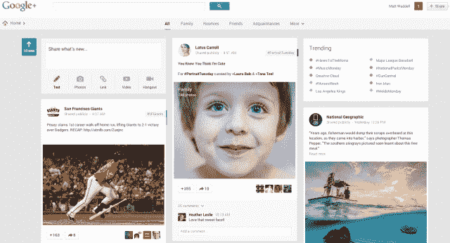
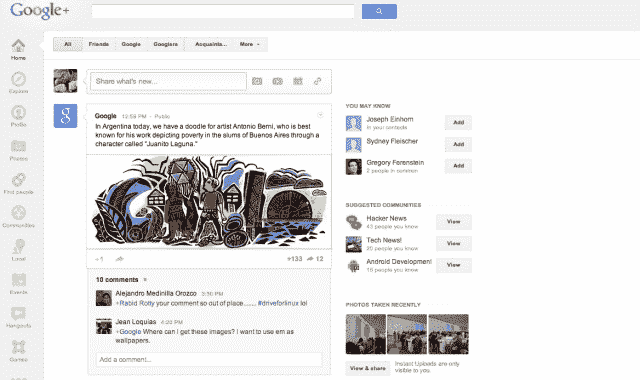
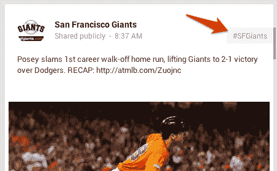
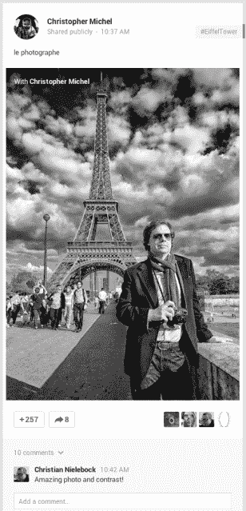
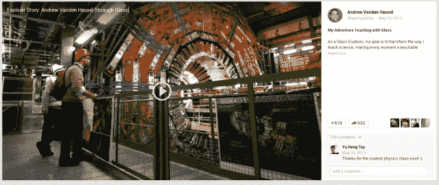
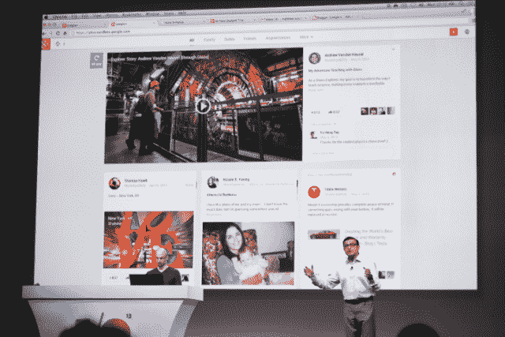

# Google+重新设计了它的流，包括多列 Google Now 风格的卡片、自动标签等等

> 原文：<https://web.archive.org/web/https://techcrunch.com/2013/05/15/google-redesigns-its-stream-to-include-multi-column-google-now-esque-cards-auto-hashtags-and-more/>

Google+是 Google [在大约两年前](https://web.archive.org/web/20221207211428/https://beta.techcrunch.com/2011/06/28/google-plus/)推出的社交层，自推出以来已经有了很大的发展。今天，该公司宣布了一个完整的重新设计，从那些甚至没有使用该服务的人那里获得了积极反馈的移动体验中得到启示。谷歌总共为 Google+推出了 41 项新功能，包括一款完全由[改进的照片产品](https://web.archive.org/web/20221207211428/https://beta.techcrunch.com/2013/05/15/google-photos-can-now-automatically-create-animated-gifs-panoramas-hdr-images-and-better-group-shots/)、 [Hangouts 应用](https://web.archive.org/web/20221207211428/https://beta.techcrunch.com/2013/05/15/google-hangouts-messaging-app/)以及人们日常互动的信息流。

目前，每月有 3.9 亿网络活跃用户，1.9 亿直接在线用户。

iOS 和 Android 上的 Google+用户将会熟悉流的变化，但也有一些新的变化。第一个值得注意的项目是 stream，它被赋予了三栏的处理方式，iPad 版的服务表现得非常好。这与 Twitter 和脸书 feed 的方法大相径庭，后者将所有内容都放在一个专栏中。多栏设计让你可以更快地浏览项目，而不是无休止地滚动来寻找互动对象。

我和谷歌工程高级副总裁维克·冈多特拉坐在一起，他向我介绍了一些新功能。他很快指出，谷歌新的“订阅”方式将会给内容带来更多的关注:

> 我们正在解决这些信号的一个长期问题，它们是平的。其他网站允许您滚动浏览与您共享的帖子。你不能再去翻阅和阅读更多的主题了。你不能在一个感兴趣的话题上深入下去。

如果你没有使用过 Google+,或者想快速对比一下这两种设计，下面是今天之前的流的样子，包括右边那个尴尬的空白:

工具栏已经被简化，看起来就像你在搜索和其他属性上看到的工具栏。静态左侧导航的日子已经一去不复返了。只有当你需要它的时候，它才会出现在“主页”按钮上。

你还会注意到信息流中的内容更加突出，这是因为它们是像 Google Now 一样的交互式“卡片”。Google+的一个新功能是，每当你发布一条新内容，它都会自动获得一个标签。如果你愿意，你可以删除它，但谷歌强大的处理能力会尝试对所有共享的内容进行分类:

当你点击标签时,“卡片”会翻转过来帮助你发现相似的内容。在《巨人邮报》的例子中，冈多拉向我展示了谷歌自动识别出这篇文章是关于巴斯特·波西的，因为该公司已经在发布的文章上部署了照片识别技术。《巨人邮报》分享的图片自然是巴斯特·波西。冈多特拉说，通过点击时不把你带到一个新的内容流，你有兴趣了解更多的内容的上下文被保留了下来。

这种自动分类的另一个例子是这张埃菲尔铁塔的图片。Gundotra 解释说，即使帖子中没有说明照片来源的文字，谷歌也能够找出它是什么，因此给它加上了#EiffelTower 标签。灰色标签是谷歌自动分配的，蓝色标签是分享者自己添加的:

对于照片和视频等内容，他们将获得与在移动设备上相同的待遇，这些内容分布在多个栏目中:

还有其他的互动动画，比如当你分享某人的帖子时的反弹。再说一遍，这些都是 Google+移动应用做得很好的事情，它意味着让你更多地参与其中。我不确定一部动画是否能让我做到这一点，但你看的头几次会觉得很有趣。

据我所知，谷歌希望你花更多的时间在信息上，少花时间浏览网站。这种新的外观，包括谷歌最喜欢的新字体 Robot，符合谷歌其他大多数产品的设计。这种熟悉会促使人们更加关注内容，但不一定会分享更多。

冈多特拉所说的这种新的河流处理方式有些道理。当你使用脸书新设计的新闻源时，你仍然会看到一个单独的栏目，允许你在不同的内容类型之间切换。虽然这可能适用于智能手机，但对于台式机来说，这可能不是最好的利用方式。至少，这是谷歌在这次改革上的赌注。

