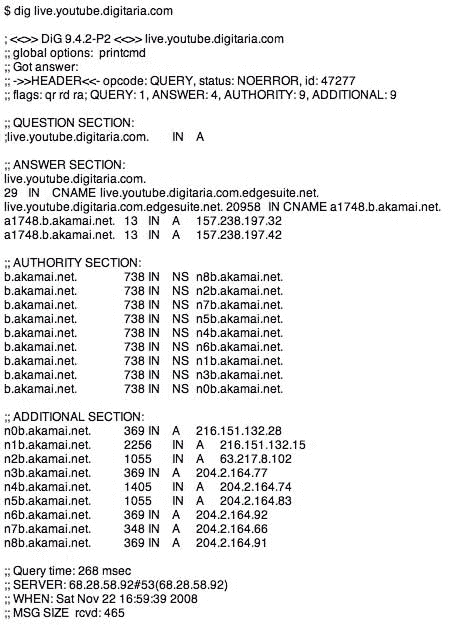

# 谷歌依靠 Akamai 直播 YouTube70 万并发观众

> 原文：<https://web.archive.org/web/https://techcrunch.com/2008/11/22/google-relies-on-akamai-to-stream-youtube-live-700000-concurrent-viewers/>

# 谷歌依靠 Akamai 直播 YouTube70 万并发观众

过去几周，有传言称谷歌不得不依靠第三方内容传输网络来使 YouTube 直播的音乐会能够正常播放。尽管谷歌有自己令人印象深刻的 CDN，但流媒体直播视频(相对于 YouTube 一直依赖的渐进式下载)是一项艰巨的任务。而且很贵——你必须许可 Adobe 的 Flash Media Server，或者像 [Wowza](https://web.archive.org/web/20230404115957/http://www.wowzamedia.com/) 这样的竞争对手，并且在正常成本之外为每千兆字节的传输支付至少几美分。

我们听到传言说谷歌已经与三大直播服务之一——Mogulus、Ustream 或 Justin.TV 合作。事实上，谷歌已经与所有这些初创公司会面，讨论合作或直接收购。

但他们没有与他们合作，或者建立自己的流媒体 CDN，而是选择与 Akamai 合作。谷歌不会证实这一点，但它是相当微不足道的检测(见下面的截屏)。为什么他们选择 Akamai [而不是合作](https://web.archive.org/web/20230404115957/http://www.mogulus.com/blog/?p=756)？一个关键因素可能是，Mogulus、Ustream 和 Justin.tv 还没有同时观看超过 10 万人的直播活动(更正:一位与 Justin.tv 有关的人发电子邮件说他们已经达到“远远超过 40 万人”)，所以今晚的音乐会对他们来说是一次可扩展性的实验。

根据 Akamai 的公共数据，大约有 70 万人观看了 YouTube 的巅峰演唱会。Mogulus 博客上有更多的信息，但基本上 Akamai 在活动开始前通过其网络提供了大约 150，000 条直播流，在演唱会的高峰期有 863，000 条。

所有这些昂贵的 CDN 基础设施实际上并不需要有效地处理直播视频流。P2P 软件可以有效地处理它，而且便宜得多，因为用户将大部分视频提供给其他人。这需要将软件直接下载到用户的电脑上，然而，Joost 尝试过，但大部分都放弃了。最终，这些东西可能会直接内置到浏览器中。

今晚证明了一件事——Akamai 可能很贵，但它确实有效。我想知道谷歌是否会让他们就此发布新闻稿。

