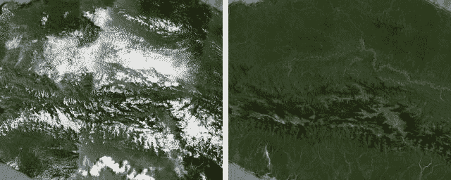
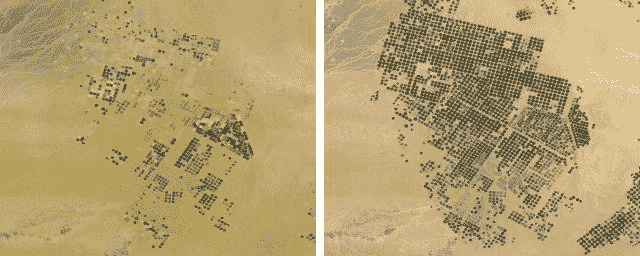
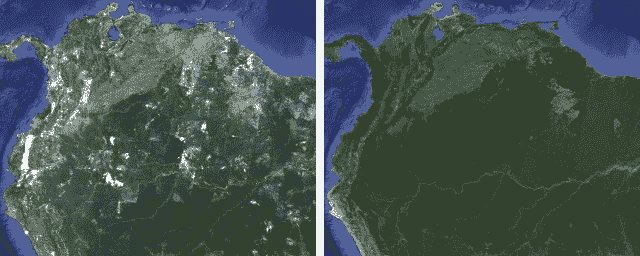

# 谷歌移除谷歌地图和地球上的所有云 

> 原文：<https://web.archive.org/web/https://techcrunch.com/2013/06/26/google-removes-all-the-clouds-from-google-maps-and-earth/>

# 谷歌移除了谷歌地图和地球上的所有云

准备好接受你的定期提醒了吗，科技是神奇的？

谷歌刚刚摆脱了地球上的云。嗯，*谷歌*地球，至少*。他们刚刚更新了谷歌地球和谷歌地图中的卫星图像，提供了比以往任何时候都更高分辨率(现在没有云)的地球视图。

通过开发他们为上个月展示的[行星时间机器](https://web.archive.org/web/20221226051926/http://googleresearch.blogspot.com/2013/06/building-visual-planetary-time-machine.html)项目构建的工具，谷歌能够处理和组合他们拥有的地球每个地区的所有照片——这是数百万亿字节的数据——直到他们几乎完全清晰地拍摄到整个地球。去吧，勇敢的冒险家！探索世界从您的五轮船，SS 赫曼米勒舒适！

作为更新的一部分，他们还更新了一些地方的卫星图像，这些地方已经有一段时间没有更新了，主要集中在俄罗斯、中非和印度尼西亚。

你现在可以在谷歌地图上查看这个星球[的新的、几乎万里无云的视图。](https://web.archive.org/web/20221226051926/https://maps.google.com/)打开卫星视图。

亲爱的谷歌:请不要试图从真实的地球上移除云层。我们可能会很快死去，我会很难过。谢了。你的朋友格雷格。 ]

看看这些拍摄前后的照片，这是谷歌人[对](https://web.archive.org/web/20221226051926/http://google-latlong.blogspot.com/2013/06/only-clear-skies-on-google-maps-and.html)的敬意:

**印度尼西亚巴布亚中部——云块前后:**

**沙特:**

**南美:**

【T2