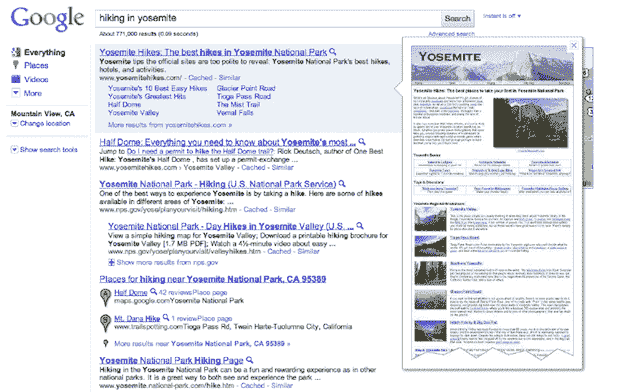

# 谷歌与 RockMelt:谁更擅长搜索预览？TechCrunch

> 原文：<https://web.archive.org/web/https://techcrunch.com/2010/11/09/google-rockmelt-search-preview/>

# 谷歌与 RockMelt:谁更擅长搜索预览？

突然之间，视觉搜索预览成了本周的热门功能。周一， [RockMelt](https://web.archive.org/web/20221006232903/http://www.rockmelt.com/) 在私人测试版中发布了其[新浏览器](https://web.archive.org/web/20221006232903/https://beta.techcrunch.com/2010/11/07/rockmelt-browser-sharing-review/)。它的一个主要特点是如何处理浏览器搜索框中的搜索。当您键入搜索内容时，结果会显示在一个列覆盖图中，每个底层页面都已预加载，因此当您单击每个结果时，它会出现在主浏览器窗口中。

今天，谷歌以其官方发布的[谷歌即时预览](https://web.archive.org/web/20221006232903/https://beta.techcrunch.com/2010/11/09/google-instant-previews/)作为回应，它已经测试了几个月。也许时机只是巧合(是啊，没错)。但是谷歌推出的搜索预览功能把它从一个大多数人甚至还不能下载的浏览器的古怪功能变成了一种主流搜索体验。你可以在这里查看谷歌的即时预览功能,直到它在各地推出。

但是谁做得更好呢？谷歌的预览版加载速度似乎更快，至少对我来说是这样(而且我用的是非常快的宽带连接)。但是眯着眼睛看一个你几乎看不清文字的网站图片并不能真正帮助我。RockMelt 方法实际上加载了站点。也许称之为预览在技术上并不准确，因为你实际上导航到了网站，但它是如此之快，以至于感觉更像是预览。你可以在上面的截图中看到不同之处。或者查看下面的截图，了解每次预览在 Rockmelt 和 Google 上如何找到相同的搜索结果。

你喜欢哪种方法？

