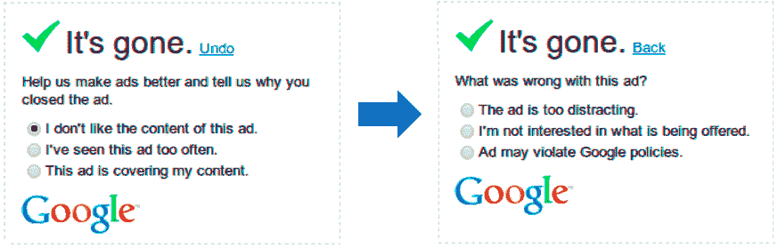

# 谷歌推出广告内调查，找出人们讨厌广告的原因

> 原文：<https://web.archive.org/web/https://techcrunch.com/2014/01/17/google-rolls-out-in-ad-surveys-to-figure-out-why-people-hate-ads/>

# 谷歌推出广告内调查，找出人们讨厌广告的原因

大约在过去的一年半时间里，谷歌让你屏蔽掉他们不喜欢的显示广告。只需点击小[x]按钮，它就消失了，再也不会向您显示。对于你非常非常讨厌的嘈杂广告来说，这是一个非常有用的解决方案，尽管事实上它们承诺向你展示一个最终减掉你所有腹部脂肪的怪异技巧。

谷歌公司表示，谷歌的用户已经屏蔽了“数百万条广告”，并把这些信息作为“让广告更相关、更有用”的信号

为了获得更多关于用户如何与其广告互动的数据，你现在也可以给谷歌[更多关于你为什么不喜欢某个广告的信息](https://web.archive.org/web/20221006173420/http://adwords.blogspot.com/2014/01/improving-users-advertising-experiences.html)。在接下来的几周里，谷歌将推出一项广告内调查，当你点击静音按钮时就会弹出。谷歌表示，这些调查将有助于它更多地了解用户偏好以及他们屏蔽广告的原因。

根据谷歌的截图，每次调查只会给用户三个选择，但看起来这个过程可能会分多个步骤进行。据我所知，用户不必真的完成这些调查就可以屏蔽广告。然而，大多数人会认为他们必须这样做，所以这可能会给谷歌提供相当多的新数据来微调其广告定位。