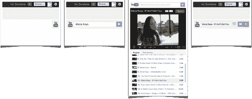
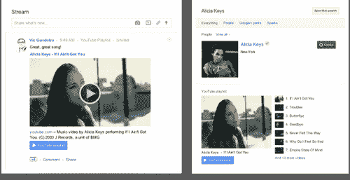
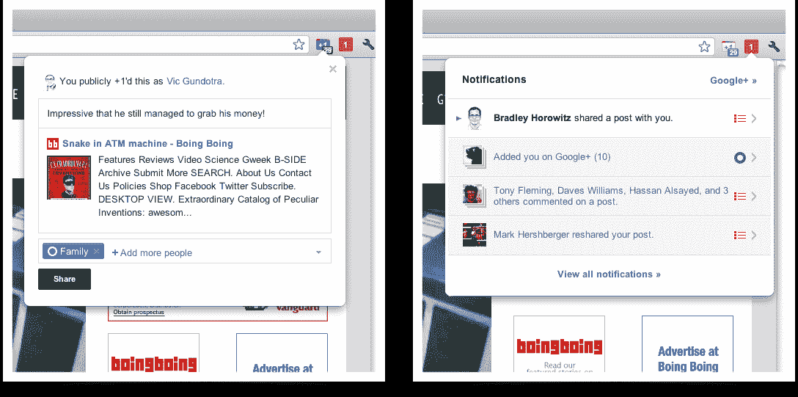

# Google+推出 YouTube 整合、新 Chrome 扩展 TechCrunch

> 原文：<https://web.archive.org/web/http://techcrunch.com/2011/11/03/google-rolls-out-youtube-integration-new-chrome-extensions/>

# Google+推出 YouTube 整合，新的 Chrome 扩展

谷歌今天发布了更多 Google+功能，旨在提高用户参与度和分享度。其中包括一个 YouTube 滑块，可以让你观看 YouTube 视频并与你的 Google+朋友分享，以及两个新的 Google Chrome 扩展，用于分享网页和跟踪你的 Google+通知。

YouTube 滑块是一个出现在 Google+主页右侧的按钮，点击后，它会滑出并显示一个 YouTube 搜索框，询问你“你想玩什么？”

当你输入一个搜索并按回车键时，会出现一个弹出窗口，有点像 YouTube 网站的缩小版，显示了与你的搜索词匹配的视频和视频播放列表。当你观看视频时，视频顶部的“+1 按钮”可以让你执行谷歌的脸书“喜欢”，而突出的绿色“分享”按钮可以让你将视频发布到你的 Google+个人资料。

对于这项新功能来说，弹出窗口不是最优雅的集成，但它完成了工作。

【T2

YouTube 的新功能还允许你的 Google+好友直接从你在网络上分享的视频帖子中打开相关的播放列表(通过更新下方的蓝色按钮)。这实际上对音乐视频之类的东西很有帮助，正如下面的例子所示。

YouTube 现在也在 Google+搜索结果中被编入索引。

今天的其他新增内容是两个 Google Chrome 扩展，其功能由第三方提供已经有一段时间了。“+1”扩展允许你点击浏览器工具栏按钮来喜欢页面并在 Google+上分享。与此同时，通知扩展显示 Google+红色通知框，指示社交网络上的新活动(新关注者、pluses 和评论)。

重度 Google+用户可能已经安装了类似的东西，但现在有了官方版本。

鉴于谷歌今年对进入社交领域的强烈痴迷，它没有像谷歌阅读器的最新更新那样，将这些扩展与谷歌 Chrome 浏览器的更新捆绑在一起，以迫使谷歌用户接受 Google+,这有点令人惊讶(是的，[我仍然对那个](https://web.archive.org/web/20230203062625/https://techcrunch.com/2011/11/02/ex-google-reader-product-manager-posts-scathing-review-of-reader-redesign/)感到痛苦)。也许这种整合仍将到来。