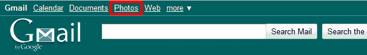
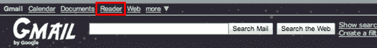

# 谷歌称删除 Gmail 中的“Reader”链接是一个错误，旨在今天将其恢复 

> 原文：<https://web.archive.org/web/http://techcrunch.com/2011/01/23/google-says-removing-reader-link-in-gmail-was-a-mistake-aims-to-bring-back-monday/>

# 谷歌称删除 Gmail 中的“Reader”链接是一个错误，打算今天恢复

 嗯……也许 RSS 终究没有[死](https://web.archive.org/web/20230202233944/https://techcrunch.com/2011/01/03/techcrunch-twitter-facebook-rss/)？周五,[将 Gmail 中的 Google Reader 链接替换为 Google Photos 链接引起了](https://web.archive.org/web/20230202233944/https://techcrunch.com/2011/01/21/google-replaces-reader-link-with-photos-in-gmail-users-in-a-tizzy/)[用户的反抗](https://web.archive.org/web/20230202233944/https://techcrunch.com/2011/01/21/google-replaces-reader-link-with-photos-in-gmail-users-in-a-tizzy/)之后，谷歌发誓要重新推出这款受人喜爱的 RSS 产品，并告诉 TechCrunch 其被移除是意外的。

虽然谷歌不确定高度戏剧化的链接将于何时恢复，但 Gmail 团队正在努力修复，并计划在周一早上恢复，据代表维多利亚·卡萨鲁说。

那么，为什么首先要删除链接呢？谷歌根据受欢迎程度决定在 Gmail 导航栏中显示哪些链接，即页面浏览量、用户数量和导航栏点击量。还考虑了需要推广的新产品。根据 Katsarou 的说法，Google Photos (Picasa)已经晋级，并将加入 Reader 的精英导航条行列，在导航条上增加第五个顶级链接。显然有人在某个地方犯了一个错误，读者链接被放到了“更多”菜单中。

周五，谷歌阅读器官方推特账户[在推特上发布了](https://web.archive.org/web/20230202233944/http://twitter.com/#!/googlereader/status/28595016557400064)关于这一错误的消息，但这并没有阻止人们给我们发邮件，表达他们对这一变化的不满。读者 Craig Cosmo 在其更好的 Gmail 浏览器扩展中集成了链接。

因此，对于那些不能等到谷歌修复的人，你可以在这里获得宝贵的 Gmail 读者链接。不客气。

**更新:**又回来了！