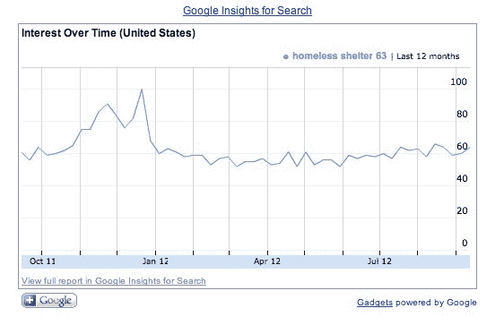

# 谷歌搜索洞察有助于激励你增加慈善捐赠

> 原文：<https://web.archive.org/web/https://techcrunch.com/2012/09/14/google-search-insights-can-help-motivate-you-to-increase-your-charitable-giving/>

# 谷歌搜索洞察有助于激励你增加慈善捐赠

我真正热爱的事情之一是尽我所能帮助慈善事业和组织。我的许多朋友和家人尽最大努力给予，无论是金钱还是时间，但很难找到合适的组织来捐赠。坚持你非常关心的事业，并从那里找到合适的组织，这是一个好主意。

谷歌今天早上发布了一个帖子，就如何激励自己去帮助那些需要更多关注的事业提出了一些建议。利用其搜索产品的洞察力，你可以对一个重要问题进行搜索，并了解该问题在谷歌上的受欢迎程度。

以下是[非营利团队不得不说的话](https://web.archive.org/web/20230326183556/http://googlefornonprofits.blogspot.com/2012/09/grow-your-gifts-online-giving.html):

> 非营利部门也看到年底季节从 12 月份延伸到 1 月份，根据同一项研究，1 月份的在线捐赠占 5%。你的非营利组织看到了同样的趋势吗？
> 
> 使用 Google Insights for Search，您可以比较特定地区、类别、时间段和酒店的搜索量模式。通过在工具中输入与你的非营利组织相关的搜索查询，你可以得到人们搜索的确切时间和数量。

该公司使用的搜索示例是“无家可归者收容所”，这是一个非常重要的支持组织类型，团队是这样说的:

> 让我们看一个例子。我们想看看“无家可归者收容所”这个词的搜索量在一年中是如何变化的。在 Google Insights 搜索中，我们输入“无家可归者收容所”一词，过滤出 2011 年 7 月至 2012 年 7 月期间美国的信息。下图显示，搜索量在 9 月份开始上升，在 12 月达到顶峰，然后在 1 月份下降。

正如你所看到的，在过去的几个月里，无家可归者收容所吸引了较少的兴趣，可能会受益于你的关注和支持。这是网络上所有这些数据有多重要的又一个例子。像谷歌这样的公司可以利用利用所有这些信息的用户友好的工具产生实际影响。

查看 [Google Insights for Search](https://web.archive.org/web/20230326183556/http://www.google.com/insights/search/) ，查看让你夜不能寐的原因。

[图片来源: [Flickr](https://web.archive.org/web/20230326183556/http://www.flickr.com/photos/parisonponce/3626635011/) ]