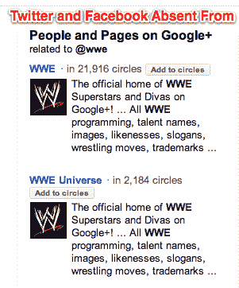

# 鲨鱼围着谷歌搜索+: EPIC 叫嚣反垄断，Twitter 提供证据 TechCrunch

> 原文：<https://web.archive.org/web/http://techcrunch.com/2012/01/11/google-search-plus/>

围绕谷歌搜索+(我们现在称之为谷歌搜索加你的世界)的水里有血。电子隐私信息中心[建议联邦贸易委员会关注 Search+](https://web.archive.org/web/20230209124909/http://epic.org/2012/01/google-changes-search-results-.html) 可能存在的隐私或反垄断问题。与此同时，Twitter 的总法律顾问 Alexander Macgillivray 提供了[明显确凿的证据](https://web.archive.org/web/20230209124909/https://twitter.com/#!/amac/statuses/157191608809422849)，解释为什么 Search+不公平地将搜索结果偏向 Google+内容，而不是最相关的结果。

搜索世界摔跤娱乐 Twitter 手柄“@wwe”会返回 5 个 Google+结果，但没有 Twitter 的迹象。但是等等，谷歌搜索没有正确处理像“@”这样的符号，所以搜索“@wwe”和“wwe”会产生相同的结果。此外，如果你还没有收到 Search+展示，尝试搜索“@wwe ”,你会得到与启用 Search+相同的结果，只是少了 Google+ People and Pages 侧边栏。

https://twitter.com/#!/amac/status/157191608809422849

所以要明确的是，Macgillivray 的截图唯一显示的是，Search+只是在一个额外的 Google+侧边栏上堆积了一个不显示 Twitter 或其他相关社交网络简介的侧边栏。哦，还有，谷歌搜索不理解符号真是可笑。在这种情况下，搜索结果不会被重新排序以支持 Google+。

尽管如此，EPIC 的执行董事马克·罗滕博格[告诉洛杉矶时报](https://web.archive.org/web/20230209124909/http://latimesblogs.latimes.com/technology/2012/01/google-likely-to-face-ftc-complaint-over-search-plus-your-world.html)关于搜索+，“我们认为这是联邦贸易委员会需要考虑的事情”。EPIC 目前正在考虑起草一封给 FTC 的信。

EPIC 认为，通过在搜索结果中显示用户朋友与用户分享的私人内容，Search+可能会侵犯隐私。我个人不同意这种观点。是的，在谷歌搜索结果中看到私人内容有点令人震惊，我们已经开始期望只有公共内容。然而，私人内容不会暴露给任何不能看到它的人，所以我认为 EPIC 是在散布关于隐私的恐惧。上周，我击落了一个类似的史诗特技，声称脸书时间线侵犯了隐私。

更有分量的是 EPIC 暗示 Search+可能有反垄断的含义。EPIC 在声明中写道，“此外，谷歌的变化正值该公司面临越来越多的审查，即它是否通过优先选择自己的内容来扭曲搜索结果。”

 正如 Marketing Land 的丹尼·沙利文解释的那样，[谷歌在 Twitter 上有足够的数据，脸书](https://web.archive.org/web/20230209124909/http://marketingland.com/schmidt-google-not-favored-happy-to-talk-twitter-facebook-integration-3151)在它的人和页面侧边栏显示他们的个人资料。不过，只有 Google+的结果会出现在那里。谷歌执行董事长 Eric Schmidt 表示，谷歌愿意与 Twitter 和脸书讨论扩大对其数据的访问，尽管它不需要这样做来使人和页面更加公平。

谷歌造就了一个伟大的政治足球，所以 EPIC 和 [Twitter 攻击](https://web.archive.org/web/20230209124909/https://techcrunch.com/2012/01/10/twitter-really-really-hates-googles-new-google-integration/)并不奇怪。不过，他们的说法有些夸张。问题不在于隐私，也不在于主题的主要搜索结果(尽管我反对在姓名搜索的 typeahead】中出现的大部分不相关的[Google+简介)。](https://web.archive.org/web/20230209124909/https://techcrunch.com/2012/01/10/google-name-search/)

问题是，谷歌有数据在人员和页面上揭露其竞争对手，但没有。嘿，也许这是一个聪明的策略，让脸书对微软的必应进行反垄断审查，从而破坏其首次公开募股。

【**更新:** [EPIC 已经向 FTC 发出正式信函](https://web.archive.org/web/20230209124909/http://epic.org/2012/01/epic-urges-trade-commission-to.html)，要求对 Search+进行反竞争调查。彭博报道称[联邦贸易委员会确实会将现有的反垄断调查](https://web.archive.org/web/20230209124909/http://www.bloomberg.com/news/2012-01-13/google-s-social-networking-service-said-to-be-added-to-ftc-antitrust-probe.html)扩大到谷歌，包括 Google+]

*对于不同的观点，看看 TechCrunch 的 Devin Coldewey 的文章[“茶杯里的谷歌+风暴”](https://web.archive.org/web/20230209124909/https://techcrunch.com/2012/01/11/a-google-tempest-in-a-teacup/)关于为什么谷歌没有义务将 Twitter 的结果包含在 People and Pages Juice Box 中。*

*【图片来源:[肯斯滕](https://web.archive.org/web/20230209124909/http://kensten.wordpress.com/2010/09/13/obama-in-the-media-shark-circle/)转自福克斯的《辛普森一家》*