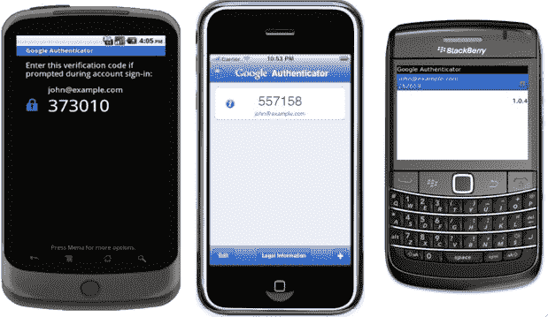

# 谷歌通过两步认证让你的账户更加安全 TechCrunch

> 原文：<https://web.archive.org/web/https://techcrunch.com/2010/09/20/google-secure-password/>

“双因素认证”可能是我写过的最不性感的功能。但是，如果你曾经担心被钓鱼或密码被黑，它可能是你最好的朋友——因为它让黑客侵入你的帐户变得非常非常困难。今天，谷歌宣布它将为其数百万用户带来这一安全功能:该功能将首先面向谷歌应用套件的 Premiere、Education 和 Government edition 客户推出，并计划在未来几个月内向*所有*谷歌用户(甚至那些不使用其应用套件的用户)推出。

那么到底什么是双因素认证呢？你可能用过的大多数登录系统都是“单因素”的——你输入一个密码就可以登录，但是如果密码被泄露，你就完了。更安全的系统在大型企业中很常见，通常需要密码*和*物理卡或加密狗才能登录——这些被称为“双因素”系统，因为它们需要你的密码和另一把钥匙，而且安全得多，因为黑客可能不会有物理令牌。不幸的是，这些安全系统通常非常昂贵。但是谷歌正在给大众带来一个。

谷歌的系统不需要实体钥匙卡。而是依赖于你的手机。首先，你需要从你的设置页面激活可选功能(同样，这最初只适用于某些 Google Apps 客户)。然后，当你登录你的谷歌账户时，你首先会像往常一样被要求输入你的密码。接下来，你会被带到一个屏幕，要求输入验证码(见上面的截图)。

验证码来自你的手机，你之前已经将它链接到你的谷歌账户。谷歌已经为 Android、iPhone 和黑莓开发了一个“谷歌认证器”应用程序——启动该应用程序，它会给你六位数的验证码，你可以在浏览器中输入该验证码(该系统还可以向你发送短信或通过语音呼叫给你代码)。

就是这样。整个过程只需要一分钟左右，但它更安全，因为任何人想访问你的帐户也需要访问你的手机。您可以选择始终要求这种双因素身份验证，也可以选择每台计算机只要求一次(换句话说，您只需要在您的家用 PC 和/或工作计算机上输入一次)。

就像我说的，这听起来可能不性感，但这是件大事。考虑到用户在谷歌上存储的数据量，以及许多人仍然经常成为网络钓鱼欺诈的牺牲品，这是帮助保护用户安全的重要一步。这些都是可选的(除非你的应用程序管理员制定了要求这样做的政策)，但我怀疑随着新系统开始更广泛地推出，谷歌将推动用户利用新系统。

这一消息还将使 Google Apps 成为对安全性敏感的企业更具吸引力的提议(Google 指出，在这一版本发布之前，它也是第一家在协作/文档共享领域获得 FISMA 认证的公司)。为了让这一点对企业更有吸引力，谷歌还开源了其认证应用，因此企业可以创建自己的定制品牌版本。