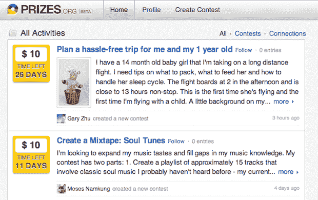

# Google/Slide Quiet 的推出继续带来奖励——金钱社交竞赛 

> 原文：<https://web.archive.org/web/http://techcrunch.com/2011/07/03/google-slides-prizes/>

# Google/Slide Quiet 的推出继续带来奖品——金钱的社交竞赛

谷歌内部的幻灯片组一直很忙。群发信息应用程序 Disco，[在三月份悄悄推出了](https://web.archive.org/web/20230203032344/https://techcrunch.com/2011/03/25/slide-disco-google-app/)。接着在上周，一个名为 Pool Party 的群体手机照片服务[进入了 T4 的私人测试阶段。今天，该团队带着](https://web.archive.org/web/20230203032344/https://techcrunch.com/2011/06/30/google-slide-pool-party/)[奖品](https://web.archive.org/web/20230203032344/http://prizes.org/)再次归来，这项服务显然旨在为有问题的人和有解决方案的人牵线搭桥——为了钱。

在 Prizes.org 发现的, [DotWeekly 报道](https://web.archive.org/web/20230203032344/http://www.dotweekly.com/google-obtains-prizes-org-domain-name)谷歌在 4 月为 Slide 获得的，奖品仍在 beta 测试中。但是它现在已经可供公众使用了——尽管竞赛的创作仍然只接受邀请。你只需注册脸书或推特(没有谷歌选项)，你就可以开始了。

一旦你注册了，你将会看到一系列你可以花钱做的活动——比如制作灵魂混音带。您可以关注这些比赛，或者深入了解更多信息。您可以提交每个竞赛的参赛作品(解决方案)。

每个竞赛都有完成的时间限制。他们可以从其他用户那里获得投票。奖品的用户也可以从其他用户那里获得消息，并获得他们关注的比赛的通知。

金钱方面目前只对有“信用记录”的用户开放，这意味着用户在过去参加过比赛或创建了自己的比赛。交易是通过 PayPal 处理的(同样，不是谷歌服务——check out)。

这个想法相当有说服力，尽管像往常一样，你很难在网站的任何地方找到任何关于 Slide 或 Google 的内容。你必须深入到服务列表中，通过谷歌找到服务背后的幻灯片。鉴于缺乏与谷歌的整合，这似乎是谷歌让幻灯片团队在公司内部随心所欲的又一个例子。我的意思是，他们真的在推动脸书联通的整合。有意思。

