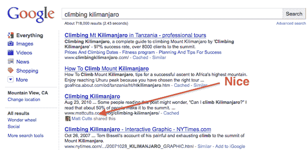

# 谷歌搜索终于完全社会化，共享 Twitter 链接，甚至 Quora 数据 

> 原文：<https://web.archive.org/web/http://techcrunch.com/2011/02/17/google-social-search/>

每周至少有几次，我们被告知谷歌正在测试一项新的“社交搜索”功能。事实是，所有人都指向的“社交圈”结果自 2009 年以来就一直存在[。但谷歌显然没有想太多，把它们一直推到了结果页面的底部。我不确定我是否点击过那里的链接。但是从今天开始，社交方面将会变得更加有趣。](https://web.archive.org/web/20230203075517/https://techcrunch.com/2009/10/26/google-social-search-launches-twitter-friendfeed-but-not-facebook-highlighted/)

谷歌轻描淡写地称之为社交搜索的“更新”,实际上要多得多。谷歌把这些社交圈链接放在页面底部，用社交类固醇给它们打气，然后把它们推到结果页面的顶部。这是第一次，社交网络将真正以一种有意义的方式影响谷歌搜索。

昨天，我们有机会与谷歌搜索产品管理总监迈克·卡西迪讨论了这些更新。他概述了谷歌正在关注的三件关键事情:混合搜索结果、增加社交覆盖面以及给予用户更多控制权。前两个是肉，第三个简直过期了。

通过“混合”结果，卡西迪意味着谷歌现在将在常规搜索结果流中显示社交结果。该链接本身看起来与其他所有链接一样——蓝色，带下划线——但它下面会显示类似“您朋友的名字共享了此内容”的内容，以及该用户的个人资料图标。

那么，谷歌是在利用社交信号来改变实际结果吗？“既有也有。在某些情况下，他们是，在某些情况下，他们不是，”卡西迪说。他拒绝透露细节，指出这是他们特制调味汁的一部分。但他确实说过，除了所有其他更传统的信号之外，该算法现在还从社会角度考虑了几件事情。

按照这些思路，卡西迪不愿证实但表示有意义的一件事是，谷歌将查看你有多少朋友分享了某个链接。这里的关键词是“分享”，以前谷歌的社交圈主要是突出你的朋友实际创作的内容，比如博客帖子。但是现在社交层的一个关键是他们实际分享的链接。

卡西迪说:“在网络上，分享比创造要多得多。事实上，他说每天大约有 1 亿次人们在分享谷歌看到的链接(记得谷歌与 Twitter 有一项协议，可以完全访问他们的消防水管)。

谷歌考虑的不仅仅是推文，还有这种新的社交活动。Flickr 和 Quora 的内容也包括在内。后者有些令人惊讶，因为这家初创公司相对较新。但是这很有意义，很明显，[我们喜欢这个动作。将会有一些优秀的数据从那里传来。](https://web.archive.org/web/20230203075517/http://www.crunchbase.com/company/quora/posts)

卡西迪表示，其他服务将在短期内以滚动方式加入该系统。

谷歌现在也让你更容易管理自己社交圈里的服务。根据你的名字，他们会扫描一些流行的服务，如 Twitter，寻找他们认为可能是你的帐户，并询问你是否希望添加它。现在有一种方法，只需点击一下，就可以从你的公开谷歌个人资料中删除任何连接。关键是，这将简单地隐藏链接到您的个人资料，但连接仍然会为您的社交结果工作。

当我问及“脸书”这个词时，卡西迪变得有点神秘。“*我们专注于相对容易抓取数据的网站*，”他指出，但没有详细说明。但这是很多内容的关键——这些内容都是公开的。谷歌通过简单的抓取获得了大部分信息。“我们有兴趣包括任何公开的内容，”卡西迪说。

而且，在明天 Scoble 毫无疑问地打破这个系统之前，应该注意的是，社交图存在一些限制。比如，如果你有 25，000 个“朋友”，谷歌可能不会把他们都计算在内。但是卡西迪说，他希望该团队能够很快解除任何限制。

最近有很多关于垃圾邮件充斥谷歌的讨论。这似乎是一个伟大的，自然的方式来削减它的大部分。我敢打赌，我会更有可能点击那些被我的朋友通过分享链接“验证”过的结果。

有趣的是，谷歌全面进军这一领域的前一天，我们非常喜欢的社交搜索领域的初创公司[终于向所有人敞开了大门](https://web.archive.org/web/20230203075517/https://techcrunch.com/2011/02/16/greplins-social-search-opens-its-doors-to-all/)。

Greplin 现在比谷歌有更多的社交挂钩(他们要求你授权第三方服务，而谷歌只是追求公共数据)，但搜索巨头承诺今天的推出只是迈向社交的一步。接下来还有更多。

