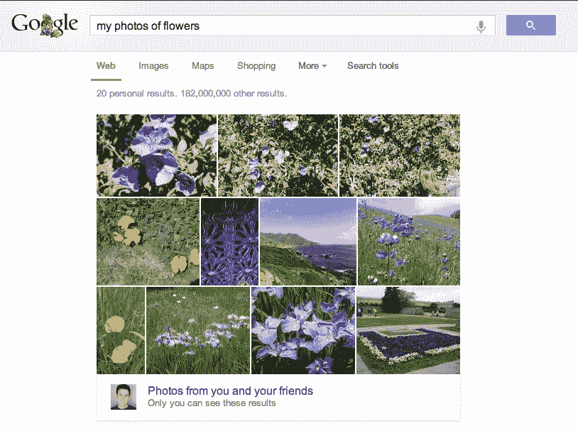

# 谷歌开始使用计算机视觉让你搜索 Google+照片 TechCrunch

> 原文：<https://web.archive.org/web/https://techcrunch.com/2013/05/23/google-starts-using-computer-vision-to-let-you-search-your-google-photos/>

# 谷歌开始使用计算机视觉让你搜索你的 Google+照片

上周，谷歌几乎完全修改了 Google+ [照片体验](https://web.archive.org/web/20221203082601/https://beta.techcrunch.com/2013/05/15/see-the-new-google-photos-experience-in-action-making-your-pics-better/)，但不知何故，该公司没有宣布其剧目中最酷的照片相关功能之一:谷歌现在使用[计算机视觉和机器学习](https://web.archive.org/web/20221203082601/http://insidesearch.blogspot.com/2013/05/finding-your-photos-more-easily-with.html)让你搜索自己的照片，如日落、食物和鲜花。我还尝试了“汽车”、“海滩”和“自行车”等词，谷歌总能返回正确的结果。这个搜索内置在 Google+中，但你也可以使用常规的谷歌搜索，并使用查询词[ [我的 xyz 照片](https://web.archive.org/web/20221203082601/https://www.google.com/search?q=my+photos) ]来找到合适的图片。

这是谷歌照片搜索的一大进步。正如谷歌正确指出的，“搜索你的照片可能具有挑战性，因为你要寻找的信息是视觉上的。”我知道我一点也不热衷于给我的照片加标签，所以这个新的搜索功能实际上让我可以找到我很久以前上传到 Picasa 网站的随机图片。

正如谷歌的维克·冈多特拉上周在 I/O 上宣布 Google+ Photos 的新功能时指出的，谷歌希望帮助用户管理他们的照片。“组织照片经常是一件麻烦事，”他说，但奇怪的是，该公司并没有在 I/O 上宣布这项搜索功能，而是在推出前等待了一周。

