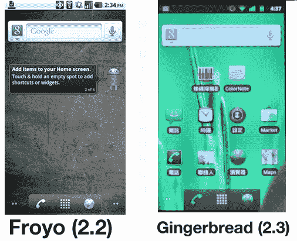
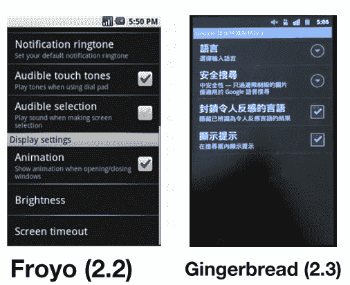

# 谷歌巧妙地在视频上展示了 Android v2.3(姜饼)，一周内没人注意到 TechCrunch

> 原文：<https://web.archive.org/web/https://techcrunch.com/2010/12/02/google-subtly-shows-off-gingerbread-on-video-no-one-notices-for-a-week/>

# 谷歌巧妙地在视频上展示了 Android v2.3(姜饼)，一个星期都没人注意到

【YouTube http://www.youtube.com/watch?v=kxToOTjmviw&fs=1&hl=en_US]

原始视频被删除了…但有人重新上传了它。如果这样下去，希望我们能找到一个更持久的来源。

哦，谷歌一下香港——你们这些骗子。

上面那个视频？仔细看。真的，*真的*紧密地联系着。好吧，一开始跳过所有 iPhone 的东西，*然后*仔细看。注意到绿色和黑色的状态栏了吗？稍微修改过的按钮？安卓市场的微妙变化？朋友们，这是尚未发布的姜饼更新(Android v2.3)。当然，这段视频不是最引人入胜的——但它是我们迄今为止看到的最清晰的姜饼片段，已经在谷歌香港的 YouTube 账户上放置了大约一周，现在还没有引起注意。

查看一些跳跃背后的细微差异的对比照片。

(*注意状态栏，曾经完全灰色的图标*中的绿色高亮显示)

(*注意设置屏幕*中已知的黑/绿样式)

[ [AndroidHK](https://web.archive.org/web/20221006085854/http://www.android-hk.com/news/android-2-3-nexus-one-demo-cantonese-voice-search/?utm_source=twitterfeed&utm_medium=twitter) 通过 [AndroidPolice](https://web.archive.org/web/20221006085854/http://www.androidpolice.com/2010/12/02/android-gingerbread-ui-gets-exposed-in-the-crispest-video-to-date/)