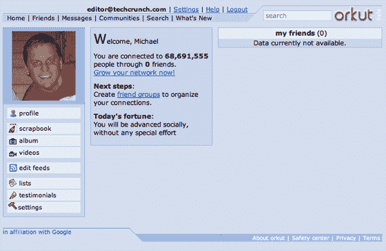

# 谷歌戏弄我们，承诺一个新的 Orkut——

> 原文：<https://web.archive.org/web/http://www.techcrunch.com:80/2007/08/24/google-teases-us-with-a-promised-new-orkut>

# 谷歌戏弄我们，承诺一个新的 Orkut

如今，我们很少提到谷歌三年前的社交网络 [Orkut](https://web.archive.org/web/20220428192536/http://www.orkut.com/) 。除了指出[宕机](https://web.archive.org/web/20220428192536/http://www.beta.techcrunch.com/2006/12/29/googles-orkut-down-for-13-hours/)或[有缺陷的 Alexa 统计数据](https://web.archive.org/web/20220428192536/http://www.beta.techcrunch.com/2006/11/01/orkut-bigger-than-myspace-ok-maybe-not/)表明它比 MySpace 更大。但是现在一些真正的新闻。

好好看看这个截屏，因为谷歌承诺给这个网站一个“更新的外观”。他们正在分批向用户发布，所以可能需要一段时间才能到达你的手中。

该死，我想我需要加一两个朋友。我当然希望他们创建一个脸书应用程序。我无法跟踪所有这些社交网络。

**更新:**查看 Orkut 的惊人[康姆斯克分析](https://web.archive.org/web/20220428192536/http://www.beta.techcrunch.com/2007/08/24/is-orkut-a-social-networking-heavyweight-comscore-says-yes/)。

**更新二:**新 look 出来了。 [zzzzzzzzz](https://web.archive.org/web/20220428192536/http://www.beta.techcrunch.com/2007/08/24/orkut-redesign-borrrrrring/)