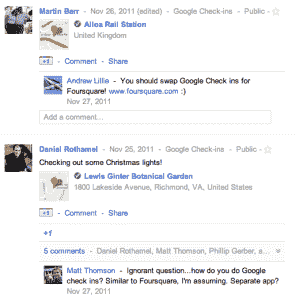
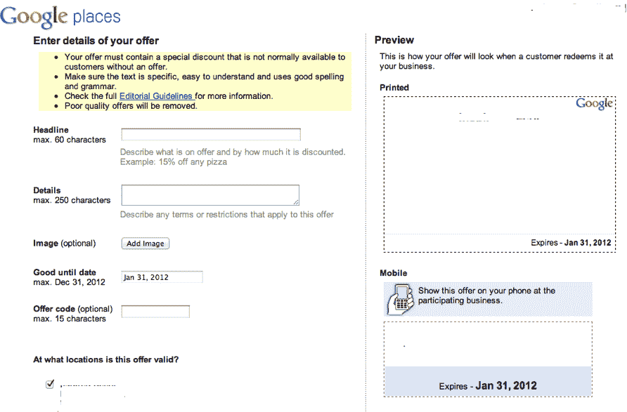

# Google+将通过即将推出的“签到优惠”功能挑战 four square 

> 原文：<https://web.archive.org/web/http://techcrunch.com/2011/12/06/google-to-take-on-foursquare-with-upcoming-check-in-offers-feature/>

看起来 Google+正在增加一项功能，允许用户通过 Google+移动应用程序“签到”，以便获得时间敏感的交易或折扣。这个功能在 [Google Places 的帮助文档](https://web.archive.org/web/20230209124937/http://www.google.com/support/places/bin/answer.py?hl=en&answer=2365055&topic=1656879&ctx=topic)中有所提及，但是还没有提供给使用[Google Places 服务的企业主](https://web.archive.org/web/20230209124937/http://www.google.com/placesforbusiness)。

不得不说，谷歌签到的历史令人困惑。

需要说明的是，通过 Google+签到的功能是*而不是*新推出的。

谷歌的基于位置的社交服务 [Google Latitude 在 Google+推出之前的二月份推出了 checkins](https://web.archive.org/web/20230209124937/http://googleblog.blogspot.com/2011/02/check-in-with-google-latitude.html) 。当 [Google+登陆手机](https://web.archive.org/web/20230209124937/https://techcrunch.com/2011/06/28/google-plus-iphone-web-app/)时，它提供了自己的签到功能，看起来是基于纬度的，可以调出附近的 Google Places 列表。

 Google Latitude 还可以让你用 Google+同步你的 Latitude 签到，[谷歌在这里解释](https://web.archive.org/web/20230209124937/http://www.google.com/support/mobile/bin/answer.py?answer=1378689)。其他文档提到了为 Latitude 用户提供的签到优惠([链接](https://web.archive.org/web/20230209124937/http://www.google.com/support/mobile/bin/answer.py?answer=1138301))，但同样，没有明确说明这些优惠将在 Google+上为用户签到。

*呼！*

是啊，现在真是一团糟。

谷歌或许应该在 Google+推出时取消 Latitude，以避免这种混乱。也许它仍然会。毕竟，现在你可以在 Google+上签到，还有很多其他地方可以找到谷歌的优惠，包括[谷歌购物应用](https://web.archive.org/web/20230209124937/http://www.google.com/mobile/shopper/) (iOS/Android)、用于 Android 的[谷歌优惠应用](https://web.archive.org/web/20230209124937/http://googlemobile.blogspot.com/2011/11/new-android-app-for-google-offers.html)和[谷歌优惠网站](https://web.archive.org/web/20230209124937/http://www.google.com/offers)。

很快，很明显，谷歌+。

新的帮助文档被 Mike Blumental 发现，他还提到谷歌 T2 最近开始打击那些不提供真正折扣的商家。企业主正在收到电子邮件，解释优惠应该提供*“货币折扣或通常不包括的额外商品或服务。”*(这是根据[这里提供的指南](https://web.archive.org/web/20230209124937/http://www.google.com/support/places/bin/answer.py?hl=en&answer=48187)。)

至于即将推出的 Google+签到优惠，这里有[帮助文档](https://web.archive.org/web/20230209124937/http://www.google.com/support/places/bin/answer.py?hl=en&answer=2365055&topic=1656879&ctx=topic)解释 Google+用户如何获得交易或折扣。上面写着(重点是我的):

> 如果您的客户为了与您做生意而必须访问您的位置，您可以要求他们**在 Google+上登记以便兑现您的优惠**。他们可以选择公开或与他们的一些圈子分享签到，这有助于在 Google+上传播你的业务。他们也可以选择不公开他们的登记，但仍然可以兑现优惠。

再说一次，这不是“Google Places”入住优惠或“Google Latitude”入住优惠，而是“Google+”入住优惠。

这是新的吗？看起来是这样的，因为企业主的选项*实际上*包括 Google+签到优惠还没有在 Google Places 的优惠标签中上线，这是此类事情得以维持的地方。这是它现在的样子(见下文):

这一切似乎意味着，Google+将很快通过整合签到交易和折扣来鼓励更多的签到，类似于 Foursquare。当然，这是一个明显的下一步，但是很高兴看到它被白纸黑字地确认…帮助文档。

**更新** : **谷歌似乎已经删除了这篇文章中提到的帮助页面。**

在移除之前，该页面还包含以下文本(感谢 Bing 缓存！):

> 如果您的客户不需要访问您的位置，例如，如果您通过送货或标注为家庭或企业提供服务，您可以关闭此选项(设置为“否”)，客户在兑换优惠时不会被要求办理入住手续。我们会使用你物品上的服务区和位置设定来决定你是否有已经建立的服务区。当您创建新优惠时，您可以选择是否允许在兑换期间办理入住手续。
> 
> 什么是值机？
> 
> 签到是一种方式，客户可以选择这种方式来记录他们在一个特定的地方。有些人分享签到记录，告诉朋友他们访问的企业。一些人私下登记(而不是与朋友分享这些信息)，这样他们就可以跟踪他们访问过的企业。
> 
> 登记对我的业务有什么帮助？
> 
> 签到是在网上推广业务的好方法。它就像一个口碑广告的在线工具。它还将优惠的使用与您的实际位置相关联，这有助于在线和离线联系客户。
> 
> 其他人会看到我的客户登录到我的企业吗？
> 
> 您的客户将选择谁可以查看他们的签入。如果签入是公开的，任何人都可以看到。如果签入与圈子共享，则家庭或同事等较小的群体将看到它们。如果签入是私有的，则只有客户可以看到。
> 
> 如果我需要登记才能兑现优惠，人们必须登记吗？
> 
> 使用支持优惠和签到的谷歌产品的客户在兑换优惠时将被要求签到。然而，如果他们使用不支持签到的产品(例如使用谷歌地图从他们的桌面打印出报价)，他们将不会被要求签到。
> 
> 兑换时哪些种类的商家应该允许入住？
> 
> 如果顾客必须到你的营业场所与你做生意，特别是为商品和服务付款，你应该允许登记。这包括大多数企业，如:
> 
> 餐馆
> 咖啡馆
> 商店
> 健身房
> 
> 如果顾客不需要进来，即使只是在某些情况下，你也不应该要求入住。这包括提供以下服务:
> 
> 像比萨递送或办公用品递送这样的递送业务
> 像水管工、屋顶工和地毯清洁工这样的服务
> 可以通过电话或互联网下单和付款的业务，比如花店