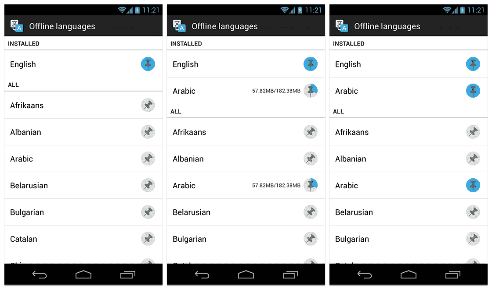

# 谷歌安卓翻译支持 50 种语言离线模式 

> 原文：<https://web.archive.org/web/https://techcrunch.com/2013/03/27/google-translate-offline-mode/>

# 谷歌安卓翻译获得离线模式，支持 50 种语言

当你在国外旅行时，谷歌翻译是一个非常有用的工具，但遗憾的是，这也是你最不可能一直连接到互联网的时候。显然，有许多离线翻译应用程序可用，但如果你偏爱谷歌翻译，并且使用 Android 手机，你会很高兴听到最新版本的 Android[谷歌翻译应用程序](https://web.archive.org/web/20221124021720/https://play.google.com/store/apps/details?id=com.google.android.apps.translate) (2.3+)现在[可以让你下载大约 50 种语言的离线语言包](https://web.archive.org/web/20221124021720/http://insidesearch.blogspot.com/2013/03/the-worlds-languages-in-your-pocket-no.html)。

现在，您只需在应用程序菜单中选择[离线语言],即可看到所有可供下载的语言包。你只需要下载你想翻译的两种语言的语言包就可以了。谷歌指出，这些词典“不如在线词典全面”，但即使是更小的词典也比没有词典有用。

谷歌也为 iOS 系统提供了一个[翻译应用](https://web.archive.org/web/20221124021720/https://itunes.apple.com/gb/app/google-translate/id414706506?mt=8)，但是还不清楚这个版本什么时候(或者是否)会有离线模式。

虽然离线模式显然是这个新版本的主要功能，但该应用程序现在还允许你用相机翻译中文、日文和韩文的垂直文本。谷歌[去年 8 月增加了对](https://web.archive.org/web/20221124021720/https://plus.google.com/114892703028341590446/posts/7uGSNF8BYDj)使用摄像头输入翻译文本的支持，去年 12 月增加了对中文、日文和韩文翻译的基本支持。这也可能是谷歌眼镜的一个杀手级功能，如果谷歌翻译团队没有在这方面努力，那将是一个惊喜(特别是考虑到谷歌翻译的[乔希·埃斯特尔](https://web.archive.org/web/20221124021720/https://plus.google.com/114892703028341590446/posts)已经是谷歌眼镜的用户，并且翻译已经在谷歌的[谷歌眼镜宣传视频](https://web.archive.org/web/20221124021720/https://plus.google.com/114892703028341590446/posts/5nkcqzLRu79)中客串了一些角色)。