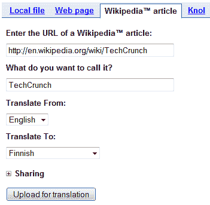
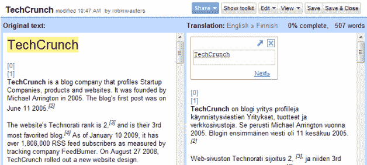

# 谷歌翻译工具包:自动化翻译遭遇众包 TechCrunch

> 原文：<https://web.archive.org/web/https://techcrunch.com/2009/06/10/google-translator-kit-automated-translation-meets-crowdsourcing/>

# 谷歌翻译工具包:自动化翻译遭遇众包

只有少数博客使用了谷歌最新的[翻译工具包](https://web.archive.org/web/20230210000520/http://translate.google.com/toolkit/)，该公司昨天通过[博客帖子](https://web.archive.org/web/20230210000520/http://googleblog.blogspot.com/2009/06/translating-worlds-information-with.html)发布了该工具包，但这项新服务确实值得再看一眼，因为维基媒体显然认为该工具可以[“改变维基百科在其他语言中的发展方式”](https://web.archive.org/web/20230210000520/http://blog.wikimedia.org/2009/06/09/google-translator-toolkit-supports-wikipedia/)。

你可以在[谷歌博客](https://web.archive.org/web/20230210000520/http://blogoscoped.com/archive/2009-06-09-n19.html)上阅读该产品的详细评论，但要点如下:

谷歌翻译工具包允许任何人上传各种格式的文档(HTML、Microsoft Word、富文本、OpenDocument 文本和纯文本)，在网上输入文件的 URL 或输入指向维基百科文章或知识单元条目的直接链接。提交后，需要翻译的文本会在后端自动翻译，并随后出现在所谓的“工作台”中，将结果文本整齐地放在目标语言的原文旁边。

Google 将在他们的翻译记忆库中搜索之前上传片段的人工翻译，并在搜索结果选项卡中显示这些翻译。彩色编码段将描述“完全”匹配和“部分”匹配，因此您可以根据记忆以及之前的人工翻译来编辑文本。此外，您可以在“计算机翻译”选项卡中使用计算机生成的翻译来快速启动当前片段的翻译。当可用时，该工具包还将搜索谷歌的多语言词汇表，以帮助您翻译您的语言的特定术语，或者您可以使用字典选项卡在谷歌的多语言字典上进行自定义搜索。

除了工具包的自学能力，该服务还使人们在翻译上的合作变得非常容易，为谷歌翻译服务的自动化流程带来了人性化的众包式接触。

(谢谢提醒， [ArabCrunch](https://web.archive.org/web/20230210000520/http://arabcrunch.com/2009/06/breaking-google-launches-translator-toolkit-an-ai-and-crowed-sourced-collaborative-english-translation-app-supporting-43-languages-including-arabic.html) )

【YouTube http://www.youtube.com/watch?v = c 7 w2 njfdoig & HL = en & fs = 1 & color 1 = 0x 234900 & color 2 = 0x 4 e9 e 00]