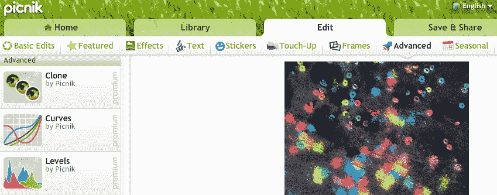
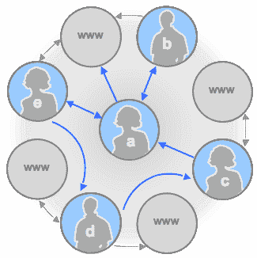

# 谷歌削减脂肪

> 原文：<https://web.archive.org/web/https://techcrunch.com/2012/01/20/google-trims-the-fat/>

谷歌有 40 多种核心产品，数百种产品取决于你如何计算它们。即使有超过 30，000 名员工，也有很多需要支持。以重新聚焦的名义，今天[公司宣布](https://web.archive.org/web/20230403092134/http://googleblog.blogspot.com/2012/01/renewing-old-resolutions-for-new-year.html)Picnik、Sky Map、海胆、Needlebase、Google Message Continuity 和 Social Graph API 都将走向死亡池、开源或被吸收到更集中的部门。

今天的淘汰是在今年夏天[关闭谷歌实验室](https://web.archive.org/web/20230403092134/https://techcrunch.com/2011/07/20/20-percent/)和大部分[前收购 Slide](https://web.archive.org/web/20230403092134/https://techcrunch.com/2011/08/25/slide-google-bloodbath/) 内部开发的产品之后。虽然谷歌长期以来一直鼓励实验，但它发现自己过度扩张了。该公司需要所有人全力以赴，为社交、移动和云计算而战。

谷歌通常会从废弃的项目中重新分配员工，而不是解雇他们。Picnik 和 Sky Map 的团队可以提高产品负责人对 Google+的专注度。运气好的话，他们可以让谷歌的社交网络更人性化。

现在，被遗忘者的命运:

基于浏览器的图片编辑器 Picnik 将于 4 月 19 日关闭，其团队可能会整合到 Google+和 Picasa 中。高级客户将[收到退款](https://web.archive.org/web/20230403092134/http://blog.picnik.com/2012/01/official-announcement-picnik-is-closing/)。Google+已经提供了创意工具包，包括基本的编辑、过滤和装饰。Picnik 使用几乎相同的界面，但包括高级编辑、框架和季节性效果，这些可能很快就会出现在谷歌的其他照片产品中。

**谷歌天空地图**——增强现实观星安卓应用[将成为开源](https://web.archive.org/web/20230403092134/http://googleresearch.blogspot.com/2012/01/open-sourcing-sky-map-and-collaborating.html)。鉴于最近 Disco、Photovine 和 Pool Party 的死亡，谷歌似乎正在远离独立应用。这将使 [Starmap](https://web.archive.org/web/20230403092134/http://www.star-map.fr/) 和 [Star Walk](https://web.archive.org/web/20230403092134/http://vitotechnology.com/star-walk.html) 的 iOS 开发者更容易开发 Android 版本。

**社交图谱 API**——谷歌在 Twitter 和 Flickr 等服务上发布的[公众互动图谱](https://web.archive.org/web/20230403092134/http://code.google.com/apis/socialgraph/)将于 4 月 20 日被弃用。该 API 允许开发者[获取关于他们用户的信息](https://web.archive.org/web/20230403092134/https://techcrunch.com/2008/02/01/googles-gathers-social-graph-information-from-the-web-launches-api/)来改进他们的产品，但是谷歌说“该 API 没有经历我们想要的那种采用”。相反，谷歌将致力于通过 Google+开发自己的社交图来追赶脸书。

**Google Message Continuity**–再也不会浪费资源在[本地企业电子邮件](https://web.archive.org/web/20230403092134/http://www.google.com/postini/continuity.html)的云备份系统上。谷歌将致力于支持其完全基于云的企业系统应用，事实证明这种应用更受欢迎。

**顽童和针座**——被收购的[谷歌分析](https://web.archive.org/web/20230403092134/http://analytics.blogspot.com/2012/01/end-of-era-for-urchin-software.html)基于客户端的前身及其[数据管理平台](https://web.archive.org/web/20230403092134/http://needlebase.com/)被正式关闭。顽童团队现在正致力于基于浏览器的分析，而谷歌仍在考虑是否整合或干脆取消 Needlebase。

给所有参与这些项目的人一个有力的握手和热情的鼓励。请记住，您不必在更多的小功能上辛苦工作。把这当成你去做大事的机会。