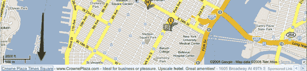
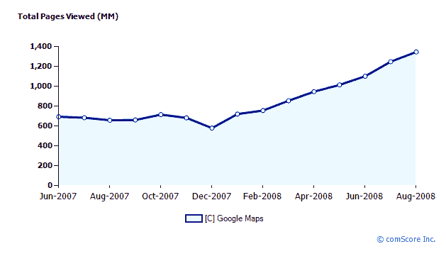

# 谷歌在谷歌地图中打开文本广告 

> 原文：<https://web.archive.org/web/https://techcrunch.com/2008/10/09/google-turns-on-text-ads-in-google-maps/>

# 谷歌在谷歌地图中打开文本广告

随着谷歌的股票在过去两周下跌了 100 美元，该公司突然不再羞于动用它所能达到的每一个广告杠杆。本周到目前为止，我们已经在 YouTube 上看到了新的点击购买按钮([YouTube evertorials](https://web.archive.org/web/20221209002408/http://www.beta.techcrunch.com/2008/10/07/still-searching-for-a-video-business-model-google-introduces-the-youtubevertorial/))，Flash 游戏的 AdSense，现在文本广告出现在谷歌地图的底部。这可能是桶测试，但当我在谷歌地图上输入“纽约市酒店”时，我会在下面看到一行文字广告，内容是时代广场皇冠酒店和纽约华美达酒店。(一个箭头让你在广告间循环)。

世界各地的其他博客也注意到了同样的事情，包括印度的阿米特·阿加瓦尔和英国的大卫·肖。这些广告是本地商业广告，但似乎是由搜索词触发的。

这些广告令人失望的是，它不是把你带到地图上的图钉上，显示做广告的商家的位置，而是像普通的搜索广告一样把你带到该商家的网站。但这更多的是关于谷歌打开了它以前忽视的广告库存，而不是创造一个优雅的基于地图的广告体验。根据 comScore 的数据，8 月份，全球有 1.31 亿独立访问者浏览了谷歌地图。他们创造了 13 亿的浏览量。这是大量未开发的广告库存。

接下来我们会在哪里看到 Google place 广告？

