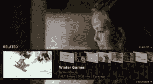

# 谷歌电视获得新的 YouTube 应用 

> 原文：<https://web.archive.org/web/https://techcrunch.com/2012/02/12/google-tv-gets-a-new-youtube-app/>

# 谷歌电视获得新的 YouTube 应用程序

上个月，谷歌开始在 CES 上展示新版本的谷歌电视，让媒体领略了即将推出的产品。一个专门讨论谷歌电视新功能的小组让鲁珀特·默多克(Rupert Murdoch)转向 Twitter，哀叹这个搜索巨头的盗版方式。[福布斯在这里有背景故事](https://web.archive.org/web/20221209020439/http://www.forbes.com/sites/jeffbercovici/2012/01/18/the-story-behind-rupert-murdochs-rants-about-google-and-sopa/)。谷歌电视 p [昨天在它的脸书页面](https://web.archive.org/web/20221209020439/http://www.facebook.com/googletv/posts/342563422441094)上发布消息，称它将在周一发布一些重大消息。

今天，[公司宣布将升级谷歌电视上的 YouTube 体验，推出一款全新的应用程序。谷歌电视的 YouTube 应用可在安卓市场](https://web.archive.org/web/20221209020439/http://googletv.blogspot.com/2012/02/new-updates-to-youtube-for-google-tv.html)下载[。谷歌电视背后的最初驱动力是创造一种将网络视频与电视无缝融合的用户体验，以改变消费者与电视互动的方式，但第一款谷歌电视没有成功。马特·伯恩斯回顾了这个版本，他说，虽然它越来越近了，但它还有很长很长的路要走。](https://web.archive.org/web/20221209020439/https://market.android.com/details?id=com.google.android.youtube&hl=en)

 在今天的声明中，谷歌承诺对其新的 YouTube 应用程序进行一些“重大改进”，其中包括导航更流畅、更快，以及对其 UX 进行一些急需的添加，如新的“发现”功能，该功能基本上只是将 YouTube 频道类别引入谷歌电视，增强了应用程序内的浏览能力。他们还带来了新的频道页面，使用户能够浏览播放列表和视频，并订阅收藏夹。

 谷歌表示，用户现在还可以通过按遥控器上的上下箭头来观看同一用户的相关视频，或者找到“信息屏幕”竖起大拇指，添加到你的播放列表，或者留下评论。

新应用看起来不错，这肯定会改善谷歌电视上的 YouTube 体验，尽管这肯定不是许多人希望的“大公告”。如果周一有更多的谷歌电视新闻，我们会保持警惕。