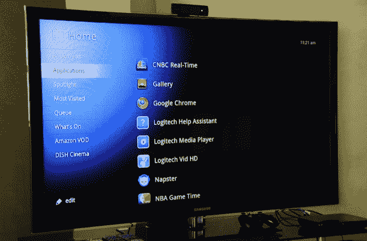
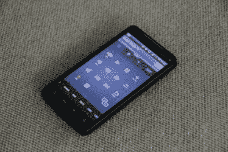

# 有了谷歌电视，我可能再也不会离开沙发了 

> 原文：<https://web.archive.org/web/https://techcrunch.com/2010/10/21/google-tv-logitech-revue/>

我已经看到了未来，它从我的沙发上的谷歌电视开始。

在极客中，将你的 PC(或 Mac)连接到你的电视并不罕见。一根像样的音频输出线，一根 HDMI 线，一切就绪。通过这个简单的设置，并对电视的输入和显示设置进行一些调整，你可以观看 YouTube 视频(或任何其他东西)——这非常酷。

但是[罗技的《T4》和谷歌电视将电视和网络的融合提升到了一个全新的水平。我可以玩几个小时。以下是我最喜欢的关于](https://web.archive.org/web/20221206010822/http://www.logitech.com/en-us/smartTV/revue)[罗技杂志](https://web.archive.org/web/20221206010822/https://beta.techcrunch.com/2010/10/06/logitechs-revue-product-page-goes-live-preorder-one-now/)和[谷歌电视](https://web.archive.org/web/20221206010822/https://beta.techcrunch.com/2010/05/20/google-tv/)的五件事，以及对功能的简要回顾。

1.网络——更大、更好，在你的电视上

如果你曾经希望可以在 47 英寸的高清电视上使用网络，你可能会想要谷歌电视。网页可以在电视上快速、清晰地呈现，并具有全部功能。(虽然 [Hulu 可能是个问题](https://web.archive.org/web/20221206010822/http://www.crunchgear.com/2010/10/18/heres-how-to-watch-hulu-on-google-tv/))。

你不仅可以浏览网页，还可以像在 Mac 或 PC 上一样与之互动。这意味着你可以轻松地输入文本——无论是推文、搜索词还是完整的博客文章。

对于那些想知道如何使用电视遥控器来做这件事的人来说，答案很简单——你不需要这么做。Logitech Review 配备了一个功能齐全的无线键盘，其中包括一个触摸板指点设备，甚至可以让你像在 Mac 上一样用两个手指滚动。

你也可以得到一个更小的[迷你控制器](https://web.archive.org/web/20221206010822/http://www.logitech.com/en-us/smartTV/accessories/devices/mini-controller)，它有一个拇指键盘和许多相同的功能。两样都有，你就能最终向你的孩子证明，键盘比手机发短信更快——也许吧。

此外，你甚至可以在 iPhone 或 Android 设备上使用罗技的 Harmony 技术来控制谷歌电视。

2.**无缝视频会议**—虽然我把第二个放在我的列表中，但它确实是这个新平台最酷的功能之一。视频不仅大、明亮、清晰，还允许您通过 Skype 和其他视频通话平台与电视进行通话。

在[之前的一篇帖子](https://web.archive.org/web/20221206010822/http://www.crunchgear.com/2010/10/04/google-tvs-secret-weapon-video-calls-from-your-tv/)中， [CrunchGear](https://web.archive.org/web/20221206010822/http://crunchgear.com/) 的约翰·比格斯担心使用罗技 Revue 在谷歌电视上打电话不会像使用 Skype 那么简单。他可以不用担心了，因为事实如此。点击、连接、对话(和查看)；真的就这么简单。

谷歌电视使用罗技专门设计的摄像头[的另一个好处是，当你的电视关闭，你接到(但错过)一个电话时，一盏灯会亮起，告诉你这已经发生了。虽然你还不能留下(或接收)视频语音邮件，但已经有足够多的人要求这项功能，谷歌或罗技应该在以后添加它，或者一个有进取心的应用程序开发者将毫无疑问地为它开发一个应用程序。](https://web.archive.org/web/20221206010822/http://www.logitech.com/en-us/smartTV/accessories/devices/tv-cam)

3.**你的手机现在是你的遥控器**——在我很久以前为[mobile runch](https://web.archive.org/web/20221206010822/http://mobilecrunch.com/)撰稿时，我不止一次说过，最终你的手机将成为你生活的遥控器。有了谷歌电视，这一现实又近了一步，至少如果你有 iPhone 或 Android 设备的话。

罗技开发了免费软件，你可以在 iTunes 商店或 Android 应用市场上找到，允许你用手机完全控制罗技评论(从而控制你与谷歌电视的互动)。

你不仅可以用鼠标导航，还可以用口头命令来搜索谷歌。当我在看的时候，人们向识别器扔了一些非常粗糙的东西，但是在我看来，它似乎每次都工作。这与其他语音到文本或语音到命令的界面相去甚远。我的主持人说“supercaliflagilisticexpalidocious ”,谷歌电视实际上能够做到这一点。除此之外，该系统甚至似乎能够理解有口音的人——甚至是很重的口音。

更酷的是，使用内置的分享功能，你可以开始在手机上观看视频，如果你喜欢，你可以直接分享到你的谷歌电视上，视频将从你离开的地方继续，只是现在它会更大，更亮，更好。

4.**搜索**(–咄–是谷歌！)——你会期望任何有谷歌名字的电视平台都有很好的搜索，而 Revue 也不会让人失望。你不仅可以搜索电视上的内容和网络上的内容，还可以搜索你的 DVR 以及同一子网上的任何其他网络存储设备。家庭照片永远不会一样。

5.**安卓应用**——好吧，我把谷歌电视最有趣、最令人兴奋的部分留到了最后。谷歌电视建立在 Android 平台上，包括我在内的许多人都认为，我们不仅会看到应用程序开发的爆炸式增长，还会看到 Android 应用程序所能提供的巨大飞跃。Android 应用程序预计要到 2011 年才会问世，但等待是值得的。

凭借家庭连接的高带宽(这将比当前任何 3G 网络都好得多)以及电视提供的大得多的格式(更不用说完整的键盘)，Android 应用程序有可能变得非常令人兴奋。

一个潜在的应用程序可能是一个幻想足球应用程序，它可以在画中画显示中运行，并可以在比赛进行中向你提供关于你的幻想足球队正在发生什么的实时更新——加上视频通话功能，你可以在你的朋友不光彩的失败中打电话质问他。那只是我突然想到的一个主意。

**该收官了**

谷歌电视被博客、分析师甚至一些主流媒体大肆宣传。这并不意味着它没有交付。事实上，如果说有什么让我感到惊讶的话，那就是罗技时事杂志是多么的有能力、实用、有趣和直观，更不用说谷歌电视比普通的电视好多少了。

我的一些抱怨:和许多全新的产品一样(我测试的那个还在测试阶段)，有一些 bug 需要处理。第一个问题是谷歌电视如何处理 Flash。有些页面在 Flash 中部分或完全呈现时无法正常显示，在一个极端的例子中，我试图浏览的一个在 Flash 中完全呈现的页面完全崩溃了。罗技团队告诉我，他们已经意识到这个问题，并且正在努力解决，但截至昨晚，这仍然是一个问题。

其次，虽然界面相当直观，但不能说每个功能都是如此。一些开箱即用的功能，尤其是像通过控制键盘控制相机这样的高级功能，对于第一次使用的用户(尤其是不太懂技术的用户)来说可能不太容易理解。

也就是说，我发现整个体验比我实际接触这款设备之前预期的要好得多，也有趣得多。我本人不太喜欢赌博，但我愿意打赌，谷歌电视很有可能最终改变我们与电视互动的方式。

*Oliver Starr 是 MobileCrunch 的原始博主，目前是 Pearltrees.com[的布道者。你可以在推特上找到他](https://web.archive.org/web/20221206010822/http://www.pearltrees.com/) [@owstarr](https://web.archive.org/web/20221206010822/http://twitter.com/owstarr) 。*