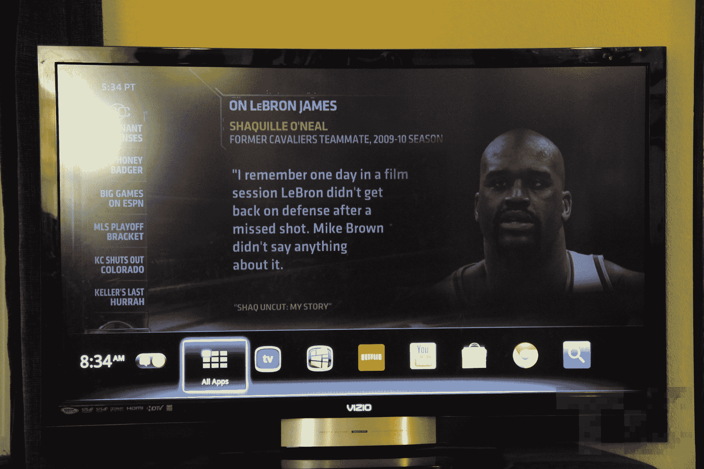
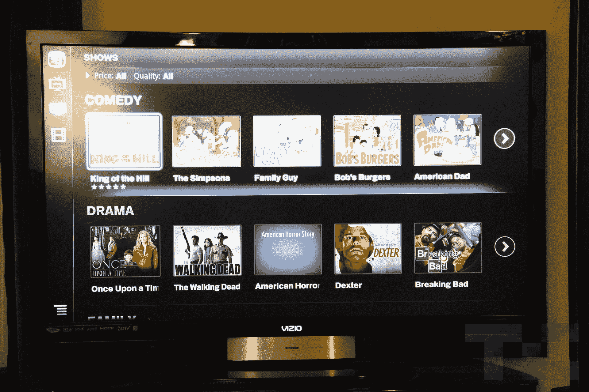

# 谷歌电视 2.0 回顾:界面精彩，但仍缺乏实质内容 

> 原文：<https://web.archive.org/web/https://techcrunch.com/2011/11/03/google-tv-v2-review-its-getting-closer/>

我怀着沉重的心情写下这篇修改后的谷歌电视评论。该产品正徘徊在一个边缘上，要么跌入黑暗的深渊，要么滑向极客世界。似乎没有退出主流的途径。谷歌电视，至少在这个[的最新版本](https://web.archive.org/web/20221208040230/https://beta.techcrunch.com/2011/10/28/just-lipstick-on-a-pig/)中，未能打动或解决[导致第一个版本](https://web.archive.org/web/20221208040230/https://beta.techcrunch.com/2010/11/01/logitech-revue-google-tv-techrunch-review/)失败的主要根本问题。哦，我多么希望谷歌电视最终成为有线电视和互联网内容之间的桥梁。但它仍然只是一个花哨的网飞和 YouTube 盒子。

听听这个:最新的谷歌电视，在这篇评论的其余部分被称为谷歌电视 2.0，是一个明星表演者。它运行起来像冠军，很明显，谷歌工程师密切关注 1.0 版本的批评。之前缺失的大部分功能和设计元素都优雅地包含在内。然而，老版本的大多数失败都与用户界面无关。内容为王，Google TV sill 不戴皇冠。

 
谷歌电视 1.0 是一个设计大杂烩。不同的屏幕有不同的设计线索；每个屏幕几乎完全不同。谷歌电视 2.0 的特点是一个基本统一的体验，Android 用户应该有宾至如归的感觉。蜂窝的影响是不可否认的，它在起居室的规模上工作得很好。

主屏幕现在是一个图标条，覆盖在背景内容上。这些是最常用的应用程序或交换为收藏夹。它还提供了应用程序的自然导航路径，以及电视和电影、YouTube 和 Chrome 的新关键功能。这是一个华丽的菜单树。

谷歌电视现在基于 Android 3.1 而不是 2.2。新系统即使在一年前的索尼网络电视蓝光播放器上也能流畅运行。谷歌此前表示，它是为旧硬件设计的，但明年将推出新型号，采用新的 CPU，因此性能应该会更好。旧的芯片组仍然被 HTML 5 应用程序卡住。任何所谓的“聚光灯电视优化网站”都断断续续，通常在运行中滞后。这是如此糟糕，以至于可以理解谷歌将所有内容聚集在一个应用程序中，而不是单独展示这些内容。这样，你知道，人们就不太可能偶然发现它们。

谷歌电视的部分吸引力在于网络浏览，这在谷歌电视 2.0 中得到了极大的改善。像书签这样的基本功能终于出现了。页面加载速度更快，总体而言，互联网体验更自然。

 
但乐趣就到此为止了。

谷歌电视的核心是为观众提供更多的娱乐内容。确实如此。它实现了这个目标，但由于 Hulu、ABC.com、NBC.com 和所有其他大型媒体的广告支持网站被屏蔽，额外的内容主要来自网飞、亚马逊和 Youtube。GTV 的优势一直在于它的搜索功能，可以将多个互联网资源和所有者的有线电视指南进行排队。新的电视和电影应用程序是对第一代搜索功能的重大修改。它智能地向观众呈现可用的内容。但可用服务的数量有限，这意味着它主要是网飞和亚马逊的替代前端。它看起来和运行起来都很棒，但这个智能指南最终还是会把用户倾倒到其他应用程序中。

在与谷歌电视的负责人 Mario Queiroz 的一次采访中，他对我说，已经为这个搜索计划了一个 API，所以它应该会随着时间的推移而增长和改进——至少在理论上是这样。这就是谷歌电视的问题所在:理论上它很棒。这听起来像是一个很棒的服务，直到你使用它，并发现它的麻烦没有任何真正的价值。

谷歌电视是一个伟大的网飞和 YouTube 盒子，但仅此而已。修改后的 YouTube Leanback 应用程序具有很好的导航路径和内容发现功能，但它似乎运行在 Flash 上，据我所知，Flash 喜欢崩溃。尽管如此，这是我见过的最好的客厅 YouTube 体验，即使是在崩溃的情况下。

 
互联网社区早就声明应用程序将拯救谷歌电视。好吧，应用程序在这里，我没有看到任何有价值的东西。当 AOL HD 是最有特色的应用程序时，你就有问题了。更多的应用程序可能会及时出现，但我个人并不关心在谷歌电视上玩愤怒的小鸟。此外，Roku XS 已经有了愤怒的小鸟*和*一个运动控制遥控器。如果大型媒体让应用程序免费访问其广告支持的内容，我对谷歌电视的负面看法可能会完全改变。

更糟糕的是，谷歌电视似乎没有太多值得关注的专属应用。大部分视频 app 只是现有 Boxee 或 Roku apps 的移植。除去谷歌电视微不足道的有线电视集成，这两款设备在许多方面都优于谷歌电视，即使进行了这次重大修改。

拿 Roku 设备来说。整个系列都可以访问相同的源，比谷歌电视高出 100 多个流媒体源。大多数并不令人难忘，但 Roku 有三大网站:网飞、亚马逊和 Hulu Plus。剩下的都是花红而已。谷歌电视通过统一搜索击败了 Roku，但 Roku 有更多的内容。Roku 设备也没有高质量的网络浏览器，但额外的内容——以及一个足以让你的祖母使用的界面——使它成为那些只想用额外内容补充有线电视的人的简单选择。

Boxee 盒子售价 179 美元，比罗技 Revue 谷歌电视贵 80 美元。但对大多数人来说，额外的现金是非常值得的。谷歌电视在网络浏览部门再次拥有 Boxee beat，尽管 Boxee 确实有内置客户端，但遥控器只有一个四向方向键，这使得导航有点费力。但是 Boxee 有一个和谷歌电视非常相似的统一搜索。它没有 GTV 的漂亮，但由于 Boxee 仍然可以访问 ABC.com、NBC.com 等网站，搜索功能提供了更多可用资源，其中大部分是免费的。此外，就像谷歌电视一样，它会查看本地网络资源，但 Boxee 不依赖 GTV 这样松散的 DLNA 服务器，它可以播放几乎任何文件类型，包括来自任何网络资源的 MKV 容器和完整的蓝光光盘图像；谷歌电视 2.0 似乎只喜欢 mpeg2 和。avi 文件，它必须从 DLNA 服务器。

也就是说，谷歌电视 2.0 从根本上不同于其他设备，因为它不只是另一个盒子。Roku 和 Boxee 盒子要求用户在电视上切换输入并使用另一个遥控器，而谷歌电视则不需要。它以一种新颖的方式位于有线电视或卫星电视之间，通过谷歌电视传输内容，允许所有者使用一个遥控器来控制一切和覆盖界面。正是这一方案通过与现有设备合作，从本质上拯救了谷歌电视，并可能成为它的救星——至少最终是这样。

谷歌电视现在感觉非常像蜂窝平板电脑。谷歌正在举办一场派对，但除了社交尴尬的人之外，没有邀请任何人。只是一群人站在一起，讨论加布·纽维尔和第三集。就像蜂窝标签一样，谷歌电视 2.0 是一个坚实的开端，也是对第一代的巨大改进，但仍然没有一个必备的卖点。人们购买 Roku 设备是因为它们非常简单，而且内容丰富。同样，Boxee Box 因其对互联网媒体的热爱和巨大的文件格式支持而大受欢迎。谷歌电视有一个很好的 YouTube 应用程序和一个奇特的网飞指南。谷歌电视不一定像其他设备一样需要更多的服务，只是需要相同的数量。少一点就没关系了。

这不是谷歌电视的最后机会。更多的硬件将在 2012 年来自三星、Vizio 和其他未宣布的合作伙伴。谷歌电视一直显示出巨大的潜力，这个版本最终给这个平台带来了它应得的高质量界面。但还是缺少内容。漂亮的脸蛋对一两个热门单曲来说是好的，但持久的力量需要真正的物质，这正是谷歌电视目前所缺乏的。