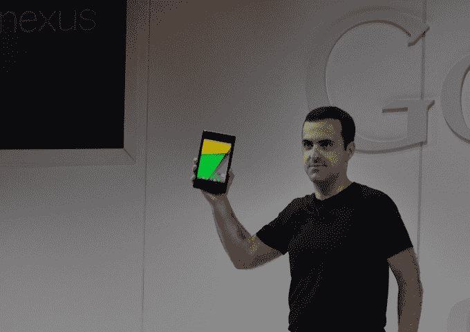

# 谷歌推出新款 Nexus 7 Android 平板电脑，这是 iPad Mini 的竞争对手，拥有超大屏幕 7 月 30 日 

> 原文：<https://web.archive.org/web/https://techcrunch.com/2013/07/24/google-unveils-the-new-nexus-7-android-powered-tablet/>

# 谷歌推出新的 Nexus 7 Android 平板电脑，这是 iPad Mini 的竞争对手，将于 7 月 30 日推出超级屏幕

谷歌今天在由安卓和 Chrome 首席执行官桑德尔·皮帅主持的特别活动上发布了新的 Nexus 7 平板电脑。由于一些早期的泄露，这款平板电脑并不令人惊讶，但它仍然是一款令人印象深刻的设备。搭载 Android 4.3 的平板电脑大幅提高了屏幕分辨率，显示屏为 1920×1200，像素密度为 323 PPI，远远高于更昂贵的 iPad mini。

以下是 Nexus 7 其他突出规格的快速分解:

*   高通骁龙 S4 Pro 1.5GHz 处理器
*   802.11a/b/g/n 无线网络
*   2GB 内存
*   16GB 或 32GB 板载存储
*   500 万像素后置摄像头，120 万像素前置摄像头
*   蓝牙 4.0
*   0.3 英寸厚，7.9 英寸 x 4.5 英寸
*   16GB Wi-Fi(229 美元)、32GB Wi-Fi(269 美元)、64GB LTE(349 美元)
*   Wi-Fi 型号将于 7 月 30 日在美国上市，LTE 版和全球型号将于“未来几周”上市

它比最初的 Nexus 7 更轻、更薄，边框也小得多，并且为便携性而设计。据谷歌的雨果·巴拉称，他们的想法是创造完全专注于设计的东西。这是市场上平板显示器的最高像素密度，色域也提供了 30%的更宽颜色范围。现在弗劳恩霍夫提供的设备中还有一个虚拟的 5.1 声音系统。虚拟环绕总是比听起来更令人失望，但比单声道音频好。

处理器提供 1.8 倍的处理能力，4 倍的 GPU 性能。有 LTE 内置，这是一个解锁选项，仅在美国可用。Batter life 提供 9 小时的高清剧本和 10 小时的网络浏览。

 谷歌再次选择华硕作为其自有品牌平板电脑的制造合作伙伴，这对这家原始设备制造商来说是个好消息，因为上一代产品是大多数人眼中最畅销的平板电脑。新款 Nexus 7 无疑超越了上一代产品，尤其是在屏幕方面，但我们必须拭目以待，看看这是否会让更多消费者转向它，远离苹果舒适的怀抱。

迄今为止，Nexus 7 已经售出约 700 万台，如果你相信一般可靠的分析师的估计的话。与苹果 iPad 的成功相比，这绝对是小巫见大巫，后者每个季度都轻松超过这个数字，但相对于其他 Android 平板电脑，Nexus 系列，尤其是小尺寸的，是一个越来越大的成功，超过了它作为谷歌展示 Android 平板电脑潜力的理想参考设计的价值。根据 Pichai on stage 的说法，它旨在解决“平板电脑的爆炸”，现在几乎有一半的平板电脑采用安卓系统。