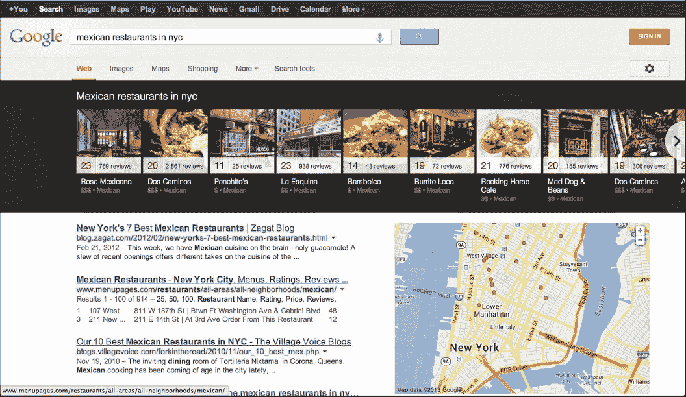

# 谷歌用转盘设计更新桌面上的本地搜索结果 

> 原文：<https://web.archive.org/web/https://techcrunch.com/2013/06/18/google-updates-local-search-results-on-desktop-with-carousel-design/>

# 谷歌用旋转木马设计在桌面上更新本地搜索结果

去年年底，谷歌为平板电脑上的一些本地搜索结果推出了一种新的设计,在页面顶部放置了一个旋转木马，上面显示的是最热门的结果。今天，它也将这个设计[带到了桌面](https://web.archive.org/web/20221210052322/https://plus.google.com/u/0/+google/posts/KpsbyvHUotN)。谷歌表示，这项新功能可以通过搜索餐馆、酒吧和其他地方来触发，目前它正在美国推出英语版，未来应该会推出其他语言版。

查看该功能的典型搜索是“纽约的墨西哥餐馆”然后，谷歌会将旋转木马放在页面顶部，包括照片、标准 Zagat 评级、价格等级和美食。点击这些地方会显示他们的 Google+本地网站，上面有更多的信息。

用户可以点击右边的箭头来查看更多的地方，他们可以使用侧边栏中的地图来放大，旋转木马会自动将您的搜索限制在这个特定的区域。

当然，谷歌也为它的一些[知识图结果](https://web.archive.org/web/20221210052322/https://beta.techcrunch.com/2012/09/05/google-to-start-displaying-knowledge-graph-carousel-to-users-globally/)使用了类似的设计。正如许多[的博客作者](https://web.archive.org/web/20221210052322/http://searchengineland.com/google-knowledge-graph-carousel-sightings-becoming-more-frequent-within-a-wider-variety-of-searches-163562)最近注意到的，这些知识图表传送带结果似乎比以往任何时候都更频繁地出现。鉴于今天增加了本地搜索转盘，谷歌的统计数据显示这是一种非常有效的呈现搜索结果的方式。如果该公司在不久的将来继续将这种设计元素用于其他类型的查询，我不会感到惊讶。