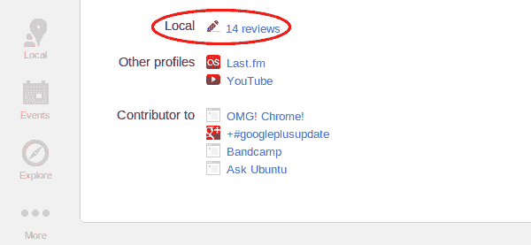

# 谷歌在 Google+ Local 上更新商业评级量表，数字不见了 

> 原文：<https://web.archive.org/web/https://techcrunch.com/2012/10/10/google-updates-the-business-rating-scale-on-google-local-numbers-be-gone/>

# 谷歌在 Google+ Local 上更新商业评级量表，数字不见了

今年 5 月，谷歌推出了自己的整合社交评论系统，为企业提供 Google+ Local。这不仅是对 Google+的一个很好的补充，而且它最终利用了[谷歌对 Zagat](https://web.archive.org/web/20221007223953/https://beta.techcrunch.com/2012/08/13/google-acquiring-frommers-travel-brand-more-google-improvements-likely-to-follow/) 的收购。话虽如此，我还没怎么用过这项服务，因为它存在一些可用性问题。

该团队似乎正在解决其中的一些问题，并推出了一些改变，例如，它要求你如何评价一家餐馆。评级系统是一种痛苦，因为你永远不知道该说什么。对于 1 到 5 的系统，我经常问自己“5 是真的超级牛逼，还是仅仅够好？”这些东西模糊了这些最终的评级，使得它们对那些过来阅读它们的人来说不是那么有用。

谷歌已经决定放弃评估场馆的数字系统，取而代之的是一个更有意义的等级——从差到优。然后，谷歌将计算一个有用的分数。

以下是来自谷歌[的 Megan Stevenson 对这些变化的看法](https://web.archive.org/web/20221007223953/https://plus.google.com/102954688457300330092/posts/LwbTUPxGdsy):

> 如今，在 Google+ Local 上撰写准确、有用的评论比以往任何时候都更容易，这要归功于我们推出的最新评分标准。如果你想给餐馆的食物或技工的质量打分，只需选择“差-一般”、“好”、“非常好”或“优秀”。在幕后，我们会将您的评分转换成数字，并将其计入显示在 Google+、搜索和地图中的企业精确的 30 分。
> 
> 试试看！点击左侧导航栏中的 Google+ Local 图标，搜索当地景点，然后点击“写评论”复习愉快！

我对情感分析非常着迷，但不幸的是，当你与互联网互动时，没有办法真正了解人们对某事的“感觉”。然而，像 Path 这样的公司在这方面做得非常好，他们提供了像笑脸和心形这样的东西。虽然谷歌没有走这条路，但我认为这是一次巨大的升级:

[")](https://web.archive.org/web/20221007223953/https://beta.techcrunch.com/2012/10/10/google-updates-the-business-rating-scale-on-google-local-numbers-be-gone/screen-shot-2012-10-10-at-12-07-40-pm-1/)

另一个不错的新功能是，你可以[通过访问好友的个人资料来查看他们对](https://web.archive.org/web/20221007223953/https://plus.google.com/106226439354629484339/posts/d7SGrFNhfDj)的评价。这是团队移除的东西，但幸运的是，它又回来了。

看到其他人留下的评论，如果他们想揭露这一点，这是找到新地方检查的一个好方法，也播下了你也应该评论一个地方以帮助下一个人的种子。

至于评分，或者说基本上所有的事情，我不会用数字来思考，当用真实的词语来表达我的感受时，我更可能对我去过的地方进行评分。不幸的是，没有“绝对糟糕”的选项，这是一个我倾向于用来解释一次非常糟糕的经历的短语。

哦，好吧，也许下次吧。

[图片来源: [Flickr](https://web.archive.org/web/20221007223953/http://www.flickr.com/photos/crazyfarmer/544463608/)