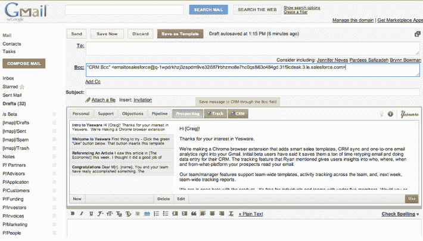

# Google Ventures，Foundry Group 投资 100 万美元用于销售人员的电子邮件跟踪和生产力平台

> 原文：<https://web.archive.org/web/https://techcrunch.com/2011/09/27/google-ventures-foundry-group-put-1m-in-email-tracking-and-productivity-platform-for-salespeople-yesware/>

# Google Ventures，Foundry Group 向销售人员的电子邮件跟踪和生产力平台 Yesware 投资 100 万美元

帮助跟踪电子邮件和提高销售人员工作效率的初创公司 Yesware 已经从谷歌风投、Foundry Group 和其他投资者那里获得了 100 万美元的资金。

Yesware 是一套生产力服务，在销售人员工作的地方工作——在他们的电子邮件和电话上。该应用程序可用于 Gmail 和智能手机，并提供电子邮件分析、可定制的模板和 CRM 集成，以帮助销售人员更快地达成更多交易。Yesware 与许多流行的 CRM 平台协同工作，包括 Salesforce.com、微软动态、甲骨文 CRM、Highrise 等。

Yesware 包括可定制的电子邮件模板，适用于销售过程的每个阶段，从发现潜在客户到达成交易；smail 和 CRM 系统之间的自动同步；基于活动的报告提供了关于个人销售人员如何与客户建立融洽关系的客观指标，以及电子邮件跟踪。

该应用程序的跟踪功能报告收件人打开电子邮件的时间、次数、位置和平台。Yesware 将根据客户参与度对电子邮件对话进行优先排序，这样销售人员就可以花更多时间与感兴趣的潜在客户交流。该应用程序还附带了一个配套的 Android 应用程序。

正如 Yesware 的首席执行官和创始人 Matthew Bellows 告诉我们的那样，该应用程序的美妙之处在于它在 Gmail 和 CRM 产品的基础上提供了一个智能和生产力层。

Yesware for Gmail 对个人销售人员是免费的，对销售团队也是免费的。安卓版 Yesware 可以通过安卓市场一次性购买，价格为 4.99 美元。该公司的客户包括 KissMetrics、StackOverflow 等。新的资金将用于产品开发。

