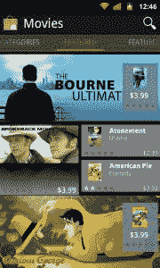
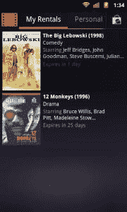

# 谷歌视频将电影租赁引入安卓手机 

> 原文：<https://web.archive.org/web/http://techcrunch.com/2011/08/12/google-videos-brings-movie-rentals-to-android-phones/>

# 谷歌视频为安卓手机带来电影租赁服务

谷歌的[视频](https://web.archive.org/web/20230203065938/https://market.android.com/details?id=com.google.android.videos)应用，安卓市场电影租赁的官方视频播放器，已经[更新](https://web.archive.org/web/20230203065938/https://market.android.com/details?id=com.google.android.videos&feature=search_result)到安卓智能手机上。此前，该应用仅在 Android 平板电脑操作系统 Android 3.0(蜂巢)上受支持。

最新的更新并不兼容所有的 Android 手机，然而，只有那些运行两个最新版本 Android 的智能手机:Android 2.2 (Froyo)和 Android 2.3 (Gingerbread)。

一旦该应用程序安装到您的 Android 手机上，您将可以从 Android Market 上获得您自己的租赁以及存储在您手机上的任何个人视频。就我而言，由于我的设备上目前没有任何租赁，因此“我的租赁”部分包含了一个“热门租赁”列表。

这款应用似乎是为了配合 Android Market 的更新版本[而设计的。当你在谷歌视频中时，如果你有最新版本，点击主屏幕右上角的小市场图标会自动打开完整 Android Market 应用程序中的电影部分。我们听说，这个版本还没有在所有的安卓手机上发布。(值得一提的是，不久前我通过一个独立的 APK 从](https://web.archive.org/web/20230203065938/https://techcrunch.com/2011/07/12/android-market-overhaul-starts-rolling-out-videos-books-and-more-discovery-options/) [XDA 开发者](https://web.archive.org/web/20230203065938/http://forum.xda-developers.com/)论坛获得了更新。我爱安卓的另一个原因！).

如果你还没有更新的 Market 应用程序，并且你也不想到处寻找被黑客攻击的 APK 文件，你可以从 Android Market 的在线版本租用视频。

就像在平板电脑上一样，更新后的智能手机应用程序允许你通过 Wi-Fi 播放电影或“锁定”电影，允许你将电影下载到手机上离线观看。电影租赁的有效期是 30 天，但是一旦你开始播放租赁的电影，你只有 24 小时来看完。

【T2