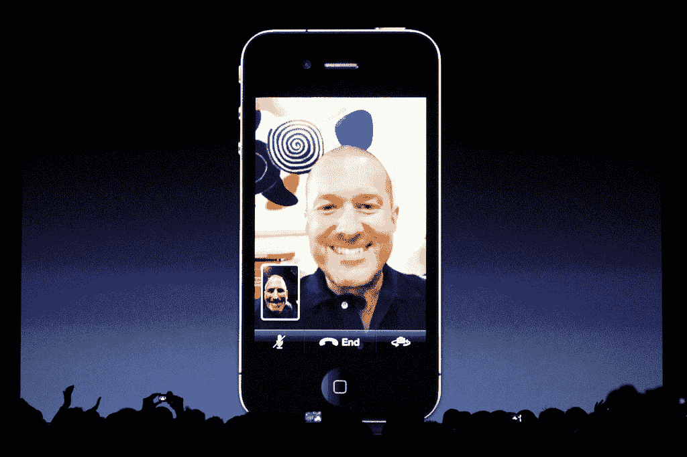

# 谷歌语音和 face time——为什么运营商正在失去他们的声音 

> 原文：<https://web.archive.org/web/https://techcrunch.com/2010/11/07/google-voice-and-facetime-why-the-carriers-are-losing-their-voice/>

最近，围绕消息、VoIP 和视频通话的新闻似乎层出不穷。苹果公司最近宣布，他们已经为苹果电脑增加了 FaceTime 支持[，自 6 月份以来，已经售出 1900 万台支持 FaceTime 的 iOS 设备。谷歌语音上周也因](https://web.archive.org/web/20230203004608/http://www.crunchgear.com/2010/10/20/apple-adds-facetime-to-macs/)[宕机](https://web.archive.org/web/20230203004608/https://techcrunch.com/2010/11/05/google-voice-goes-down-again/)成为头条新闻，但我认为与宕机相关的更大新闻是它们增长的速度。围绕消息和通信也有一系列创业活动，例如超级创新的 [GroupMe](https://web.archive.org/web/20230203004608/http://groupme.com/) 发布了 [Android 应用](https://web.archive.org/web/20230203004608/https://techcrunch.com/2010/11/03/groupme-for-android-is-now-live/)。

所有这些看似不同的公告的响亮主题是，消息、语音、视频和聊天应用程序火了。当然，我们都使用社交媒体，但这并没有降低人们发短信或打电话的热情。

更具启发性的是，所有这些创新似乎都发生在应用层，而不是世界上的 AT & Ts，他们错过了发生在他们网络顶部的另一波创新。很明显，谷歌和苹果正在提议成为你事实上的语音和消息提供商，而运营商们正坐在那里，努力计划如何保持相关性。

**为什么运营商在语音和信息方面变得无关紧要**

抨击运营商很容易。我最近写了关于技术原因[为什么& T 的网络如此糟糕](https://web.archive.org/web/20230203004608/http://stevecheney.posterous.com/the-truth-why-iphone-users-will-ditch-att-and)这让他们的上级[联系我](https://web.archive.org/web/20230203004608/http://twitter.com/stevecheney/status/28748515885)并抱怨我写的东西。事实是，AT & T 的失败背后有长期存在的原因——网络决策需要很多年才能展开，尤其是因为电信垄断本质上对变化和创新反应缓慢。

但是忘记过去，让我们看看为什么在未来的*中，除了成为管道供应商之外，航空公司将变得越来越无关紧要。让我们具体围绕语音和消息传递来做，这是它们发展提供的基本服务。*

想象一下智能手机通信的未来:你正在通过不同的网络与你在世界各地的另一半进行视频通话，你点击你的屏幕，当你继续通话时，他们的手机屏幕立即模仿你的屏幕。或者想象一下，向一群人发送彩信，当您的每个朋友打开它时，他们会立即接入您正在向每个人广播的实时高清音频/视频流。没有延迟，没有拨号，没有进入和退出不同的应用程序-它只是工作。

所有这些令人惊叹的用例，以及更多，都将通过 4G 无线标准得以实现。这是因为 4G 是 100%基于 IP 的，而这正是互联网的基础。今天，由于传统的“电路交换”架构，移动网络上的语音路由与数据路由是分开的。在 4G 的第一阶段 LTE 中，语音和视频会话将被打包，并从智能手机通过网络发送，就像任何其他应用层数据一样，这将带来一系列新功能。

**LTE Now；2013 年的声音–你在开玩笑吗？**

但是要实现这种无处不在的愿景，还有一个障碍。现在[运营商不能同意](https://web.archive.org/web/20230203004608/http://www.lightreading.com/document.asp?doc_id=198352)在语音方面发生的事情。按照传统的方式，他们陷入了无休止的联盟会议，争论标准，而不是前进，选择一个，测试和部署。

一些运营商支持名为 IPMS (IP 多媒体子系统)的语音技术，这是一种 100%基于 IP 的技术，而其他运营商则坚持使用 VoLGA(通过通用接入的 LTE 语音)，这种技术将移动语音和消息从基于 IP 的 LTE 网络中分离出来，称为“电路交换回退”。

猜猜他们打算什么时候解决这一切？2013!根据几周前的一张幻灯片。很容易想象任何超过这个日期的决议，这是疯狂的考虑到运营商的利害关系，因为他们在努力保持语音通信的相关性。

FaceTime 最好地预示了它们日益减少的相关性，因为通过 WiFi 的视频通话完全绕过了运营商网络。尽管 FaceTime 还不能在 3G 上使用，但你可以看到不祥之兆。与此同时，谷歌语音仍然要求你使用运营商的网络拨打电话，但是谷歌[去年收购 Gizmo5](https://web.archive.org/web/20230203004608/https://techcrunch.com/2009/11/09/exclusive-google-has-acquired-gizmo5/) 预示着这种情况也将消失，取而代之的是完全的 VoIP。当然还有 Skype，它现在通过 3G 工作，也绕过了你的运营商的语音网络。

**运营商错失良机背后的官僚主义**

运营商正在从封闭的电信模式向开放的互联网模式转变。在过去，他们为标准争论多年被认为是可以接受的，但是互联网上的创新不是这样。

最近在 [CTIA](https://web.archive.org/web/20230203004608/http://www.ctia.org/) ，威瑞森拒绝讨论沃尔特的情况，因为他们根本没有任何有凝聚力的东西可以交流。这很尴尬，考虑到他们的 LTE 网络应该在今年年底准备好。这意味着在未来的几年里，语音将在他们的旧网络上传送——太棒了。

这是荒谬的，也是电信联盟和标准机构如何工作的象征——任何曾经卖给运营商或与运营商互动的人都明白他们行动的缓慢。运营商真正需要做的是起床并解决如何将语音打包，然后向前移动并部署它。他们做不到这一点很尴尬，但这并不奇怪，因为他们仍然从语音计划中获得如此多的收入。

**互联网又赢了——回到睡眠载体**

移动通信的未来正在应用层书写——既有像苹果和谷歌这样的创新巨头，也有像 GroupMe 和 Twilio 这样的小型初创公司——而不是由 at 和 Verizons 在基础设施层书写。运营商有机会通过 4G 提供更好的语音和短信体验，并对这种体验收取费用，但他们错过了这个窗口。

苹果和谷歌正在迅速关闭它。回到 6 月，当 iPhone 4 发布时，人们想知道为什么苹果要让 FaceTime 成为开放标准。这里有一个重要的原因:一个封闭的标准可能会导致视频通话市场过于分散，这肯定会有利于运营商。这很可能，至少在一定程度上，是史蒂夫·乔布斯决定开放 FaceTime 的原因，因为任何开放标准在视频/电话方面的成功都会限制运营商的力量。

有趣的是，没有史蒂夫的帮助，他们似乎把一切都搞砸了。毫无疑问，语音和消息传递的未来在于公司在应用层的创新，我的猜测是，随着新的实时通信工具在未来几年的开发，这一领域将会有大量的投资活动和 M&A。

_________________________

撰稿人[史蒂夫·切尼](https://web.archive.org/web/20230203004608/http://twitter.com/stevecheney)是一名企业家，以前是一名工程师&程序员，专攻网络和移动技术。