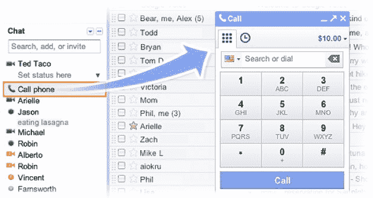
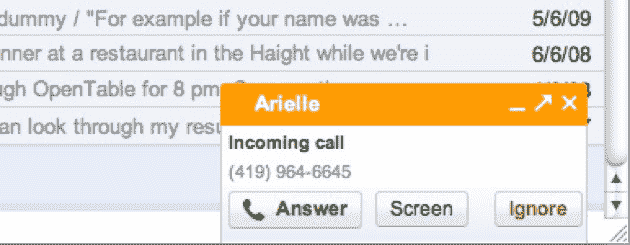

# 谷歌语音集成到 Gmail 中。通过浏览器拨打和接听电话 

> 原文：<https://web.archive.org/web/https://techcrunch.com/2010/08/25/google-voice-integrated-into-gmail-make-and-receive-calls-from-the-browser/>

# 谷歌语音集成到 Gmail 中。从浏览器拨打和接听电话

当我们拿到桌面版谷歌语音的未发布版本[时，我们感到非常兴奋，这种版本允许用户通过电脑上的软件电话拨打和接听电话。不过，我们听说这个软件还在搁置中，不会很快推出。但这可能无关紧要——今天，谷歌语音正通过 Gmail 集成到浏览器中。它非常好——我知道这一点，因为我在过去几天一直在测试它。](https://web.archive.org/web/20230209035816/https://techcrunch.com/2010/07/01/exclusive-video-of-unreleased-google-voice-desktop-app/)

只需为你的浏览器下载 [Google Talk 插件](https://web.archive.org/web/20230209035816/http://www.google.com/chat/voice/)，你就可以直接从 Gmail 拨打任何美国或加拿大的电话号码。如果你已经使用谷歌语音，你也可以在任何地方打电话，每分钟收费很低。该功能完全集成到谷歌语音中，这意味着你可以设置谷歌语音在 Gmail 中接收呼叫，并使用你的谷歌语音通讯录。拨打电话号码就像普通电话一样。只需点击聊天列表顶部的“呼叫电话”,然后拨打一个号码或输入联系人的姓名。

如果你在家里或工作场所手机信号不好，这是一个好消息，因为你可以在任何有 Wifi 信号的地方打电话和接电话。其他一些非常酷的功能:如果你使用 Google Voice，并从 Gmail 中接听电话，你可以将电话切换到手机上，并在移动中继续通话，而不必挂断电话并重新连接。

通话质量非常非常好，堪比 Skype。请参见下面我们执行的测试电话的视频。(全屏播放以获得最佳观看效果，并确保查看下面的截图)。

定价:
至少在年底前免费拨打美国和加拿大的电话。谷歌 PM 实时通讯 Craig Walker 表示，他们希望无限期地免费提供这些电话，前提是国际电话的利润能够覆盖免费的美国/加拿大电话。
拨打几十个国家的座机费率为 2 美分/分钟，不收接通费。
移动费率通常比竞争对手便宜。

