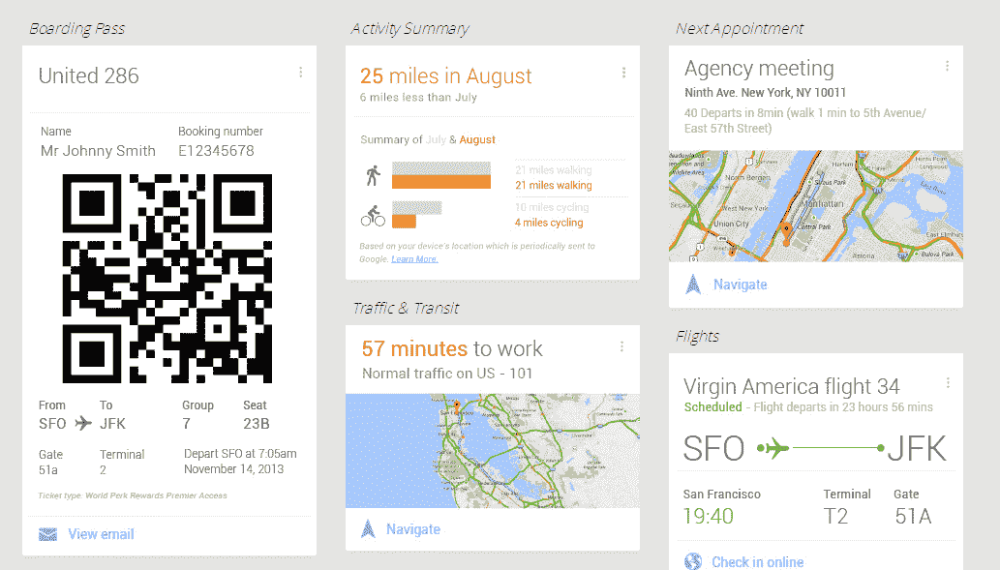

# 谷歌希望打造终极个人助理 TechCrunch

> 原文：<https://web.archive.org/web/https://techcrunch.com/2013/12/25/google-wants-to-build-the-ultimate-personal-assistant/>

谷歌搜索正在迅速变化。鉴于该公司对小规模快速更新的热爱，有时很难跟踪该公司的发展方向，但本月早些时候，在巴黎举行的 [LeWeb](https://web.archive.org/web/20221006200921/http://leweb.net/) 会议上，谷歌工程总监斯科特·霍夫曼(Scott Huffman)对谷歌在搜索领域的发展方向进行了非常令人信服的概述。

要点如下:谷歌知道我们对搜索引擎应该能做什么的期望正在迅速改变。根据 Huffman 的说法，旧的“十个蓝色链接”搜索结果页面正在迅速消失，取而代之的是更智能的东西，将更像一个个人助理，而不是 15 年前推出的搜索工具 Google。事实上，这就是霍夫曼认为谷歌的目标:创造终极个人助理。他说，下一代搜索的目的是让“你一天中的所有任务变得更简单、更快捷。”

这也意味着，在很多情况下，你会在甚至没有屏幕的东西上与谷歌互动。他认为，汽车是未来谷歌搜索的主要场所，你只需与搜索引擎互动，然后与谷歌进行对话。他认为客厅也是谷歌应该工作的地方。这可能是在大屏幕上，但也可能只是通过麦克风和扬声器，等待你的“ok Google”命令。

与谷歌的互动将以来回对话的形式进行，该公司已经为此努力了一段时间。得益于其[知识图谱](https://web.archive.org/web/20221006200921/http://www.google.com/insidesearch/features/search/knowledge.html)，谷歌在理解用户意图方面变得明显更好，它已经能够使用语音识别进行至少[有限数量的对话](https://web.archive.org/web/20221006200921/http://searchengineland.com/googles-impressive-conversational-search-goes-live-on-chrome-160445)，能够使用代词(这确实是让与计算机的对话看起来自然的第一步)。这不完全是《星际迷航》中的电脑，但显然是谷歌朝着这个方向迈出的第一步。谷歌目前处理 38 种语言，了解超过 180 亿个事实及其联系。这将创造未来的谷歌，而不仅仅是它的搜索索引。

然而，霍夫曼强调，最终的助手需要能够做的不仅仅是进行对话。它还需要积极主动，这就是谷歌现在的用武之地。通过了解你的习惯、旅行预订、OpenTable 预订和其他一切可以通过搜索你的 Gmail 收件箱找到的东西，Google Now 已经非常有用了。展望未来，我预计谷歌将继续在这个平台上构建，并向开发者开放。Huffman 承认 Google 正在研究这个问题，但是这个团队首先要解决“许多棘手的问题”。例如，谷歌如何确保来自第三方服务的通知真的很重要？(我认为用户可以自己解决这个问题，但谷歌可能希望扮演更积极的角色)。

鉴于所有这些，下一代谷歌搜索可能更多的是关于第三方开发者如何将他们的信息纳入知识图谱，而不是[欺骗](https://web.archive.org/web/20221006200921/http://valleywag.gawker.com/googles-investigating-rap-genius-for-using-spammy-seo-1489145019)谷歌的算法将他们的页面排名比竞争对手高一点。

*图片来源:* *[用户名通讯，sl](https://web.archive.org/web/20221006200921/http://www.flickr.com/photos/meneamecomunicacions/2443884255/sizes/z/)*