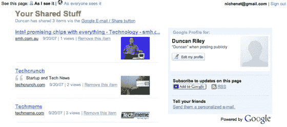

# 谷歌希望你分享东西 TechCrunch

> 原文：<https://web.archive.org/web/https://techcrunch.com/2007/09/20/google-wants-you-to-share-stuff/>

# 谷歌希望你分享东西

 谷歌凭借一款名为 [Shared Stuff](https://web.archive.org/web/20221208225254/http://www.google.com/s2/sharing/stuff) 的新产品进入了社交书签市场。

共享的东西很简单；用户将“电子邮件/共享”按钮拖到浏览器中，当他们想要将页面添加到他们的共享资料时，单击该按钮。链接可以包括图像、文本摘录和/或用户评论。然后可以通过 iGoogle 或 RSS 直接查看结果。一个有趣的补充是可以选择使用共享内容来发布其他社交预订网站的链接，包括脸书 Furl、Delicious、Reddit 和 Digg。

可以通过电子邮件邀请朋友，也可以查看 Gmail 联系人使用该服务制作的书签。

Google Blogscoped [建议](https://web.archive.org/web/20221208225254/http://googlesystem.blogspot.com/2007/09/google-shared-stuff.html)也可以通过标签或 url 搜索书签，尽管当我访问该网站时，该功能并没有立即显现出来。

谷歌已经有了书签服务(Google Bookmarks ),所以还不清楚这是一项实验，以后可能会推广到该产品中，还是计划作为一个长期的独立网站。总的来说，这不是最令人惊讶的服务；毕竟，社会化书签网站已经存在很长时间了，而且大多数情况下，一个服务看起来和另一个是一样的，然而，有了谷歌来运营这个网站，它总是有机会做得更好。

