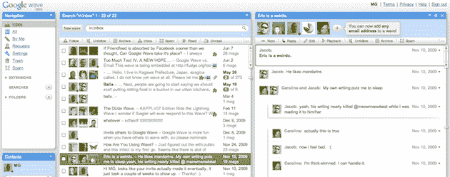

# 崩溃的谷歌浪潮 

> 原文：<https://web.archive.org/web/https://techcrunch.com/2010/08/10/google-wave-death/>

上周，当我第一次听到 Google Wave 已死于 T2 的消息时，我很惊讶。我并不感到惊讶，因为这是一个欣欣向荣、成功的产品(显然不是)。我很惊讶，因为在它推出之前和之后，我从谷歌内部听到了大量关于它的消息。听他们说，这就是未来。所以我显然很惊讶他们只给了“未来”一年的时间来证明自己。这就是慷慨。

显然，我知道这种滔滔不绝的部分是任何公司应用于任何新产品的相同的废话炒作和营销。但是看起来一些关键高管——从[维克·冈多特拉](https://web.archive.org/web/20221209235305/http://www.crunchbase.com/person/vic-gundotra)到[谢尔盖·布林](https://web.archive.org/web/20221209235305/http://www.crunchbase.com/person/sergey-brin)的每个人——确实对 Wave 感到兴奋。理应如此。正如我当时写的那样，它雄心勃勃。

但是，正如《商业内幕》上周所记得的那样，我对它的完整引用更加贴切:

> 它雄心勃勃——我们很喜欢——但这也给它带来了失败的可能性。但伟大的产品就是这样诞生的。

很明显，海浪最终落在了它的脸上。可以说，它崩溃了。没有伟大的产品诞生。

但我有一种挥之不去的感觉，它崩溃是因为谷歌没有妥善处理。理解很难吗？是的。但那又怎样——当你真正停下来思考时，电子邮件也是如此。解决问题了吗？没有。但那又怎样——推特也没有。

我认为 Wave 只不过是谷歌早期尝试失败的一个例子。因为这个产品有点复杂，谷歌自己也不知道该怎么做，或者如何推销，所以它失败了。真的就这么简单。

在我看来(显然，事后看来)，Wave 应该是一个实验性的生产力工具，被打包到 Google Docs 中。它不应该被宣传为大众的下一代通讯工具。至少一开始不会。

或者，如果谷歌真的想试着用那种方式把它推给人们，他们应该像对待 Buzz 一样，把它塞进 Gmail。

我认为 Gmail 内部的 Wave 可能会很有趣。但是作为它自己的产品，它和许多其他产品一样遭遇了同样的问题:我没有时间去那里*或者*我忘记了我应该去那里的问题。这样的小事没有得到足够的重视。但是另一个服务确实意味着我们必须访问才能使用的另一个服务。最终(越来越)我们都会耗尽时间。有太多的地方可以参观。这是一个巨大的进入壁垒。即使是对谷歌来说。

如果 Buzz 不在 Gmail 里还会有人用吗？上周，当我问谷歌首席执行官埃里克·施密特关于 Buzz 的问题时，他听起来也不太确定。他还证实，他们曾考虑像 Buzz 一样将 Wave 放入 Gmail，但最终决定放弃。

施密特在那次谈话中说的另一件有趣的事情是:

> 我们尝试新事物。记住，我们庆祝我们的失败。在这家公司，尝试一些非常困难的事情，让它不成功，并从中吸取教训是完全可以的。

我喜欢这个主意。虽然有些人可能认为他不真诚，但根据我与我见过和/或认识的大量谷歌员工打交道的经验，我相信谷歌的文化实际上非常类似。

问题是，你需要给这些类型的实验时间。当然，你不应该让一个行不通的想法让公司破产。但很明显，这里没有发生这种事。而且看起来谷歌并没有尽力帮助 Wave 发展。

还记得谷歌是如何将 Wave 定位为一个开发者可以在其上构建的协议，而不是产品吗？这个想法怎么了？我不是唯一一个想知道 T2 的人。我只是不知道你怎么能在不到一年的时间里就把那个宏伟的想法扔出去，然后又把它扼杀掉。

老实说，说谷歌给了 Wave 一年时间是很慷慨的。虽然它是在去年的 I/O 上推出的，但实际上直到几周后才开始向一小部分人推出。大多数人直到几个星期后才接触到它——有些人甚至要等上几个月。见鬼，直到今年五月才完全开放。和 2010 年一样。就像三个月前一样。

我的意思是，真的肯定没有人使用谷歌的 Wave 在项目向公众开放后这么快就能完成项目。

但是，他们又期待什么呢？这是一项本应成为平台的服务。这是一个真正作为服务存在的平台。这是一项用户界面令人困惑的服务。这是一个有 20 多个按钮要按的服务。这与[保持简单，愚蠢](https://web.archive.org/web/20221209235305/https://beta.techcrunch.com/2009/04/28/keep-it-simple-stupid/)正好相反。太奇怪了。

但是它背后的技术看起来相当可靠和有趣——特别是在谷歌认为的网络未来的范围内:HTML5。谷歌在谷歌文档上花费了如此多的时间和精力，试图扼杀微软 Office，但实际上他们所做的只是将大部分相同的 Office 创意放在网络浏览器中。为什么不振作起来，尝试使用 Wave 技术让协作变得真正有趣呢？显然，这应该是实验性的——但正如我们刚才所说，这是谷歌的事情:实验性的。

我喜欢认为我自己对一项新服务的自然使用是一个很好的晴雨表，它会做得如何。老实说，和其他人一样，我没有使用 Google Wave。但奇怪的是，我想让 T8 使用 Google Wave，却没有一个令人信服的理由。那是在谷歌上。

人们的兴趣显而易见:看看易贝上数以千计的请柬以荒唐的价格出售。事实上,“Google Wave”是 TechCrunch 数月来的热门搜索。见证它在 Twitter 上成为热门话题的时间有多长。有人找我写一本关于 Wave 的书——甚至在它发行之前。见证其死亡的报道。

让我们希望谷歌能够像施密特所说的那样，从 T1 中学到东西，并应用到谷歌我身上。