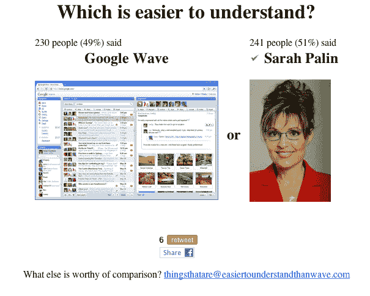
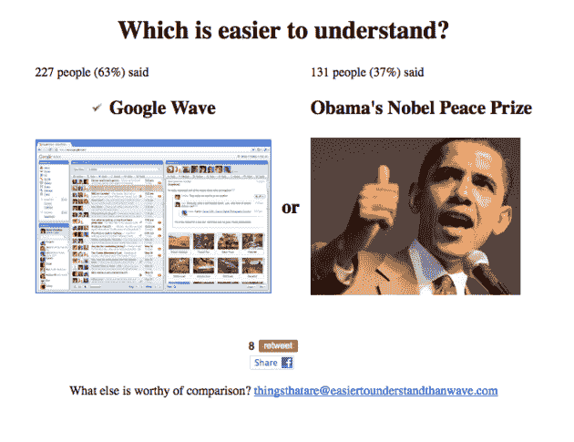
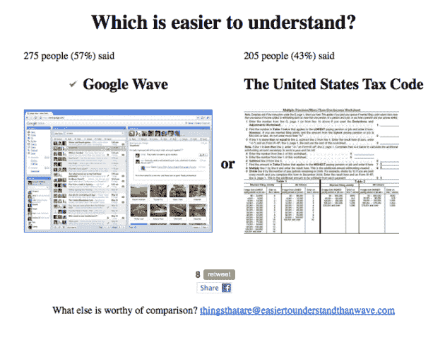
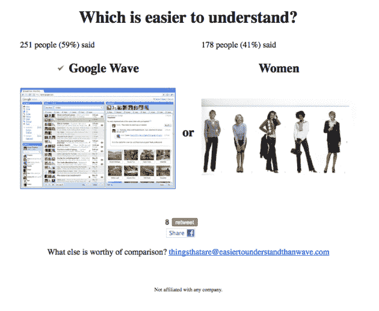

# Google Wave 比...

> 原文：<https://web.archive.org/web/https://techcrunch.com/2009/10/09/google-wave-is-easier-to-understand-than/>

# Google Wave 比……更容易理解

正如我们多次提到的， [Google Wave](https://web.archive.org/web/20221209225049/http://wave.google.com/) 是一项很难解释的服务。而且对很多人来说，也很难理解。这似乎有点合理，因为它正试图成为一种新的通信形式，而且它还处于生命周期的早期。但是理解起来有多难呢？一个新网站精彩呈现。

Easiertounderstandthanwave.com 反对生活中其他难以理解的方面。在网站上，你会看到一张 Wave 的图片和一张其他东西的图片，并被要求点击哪个更容易理解。Wave 的竞争包括:玄学、*唐尼·达科的终结、*、奥兹·奥斯朋、死亡、渗透压、心胸外科手术、医疗改革法案、[谷歌快速翻转](https://web.archive.org/web/20221209225049/http://www.beta.techcrunch.com/2009/09/14/a-new-way-to-visually-search-google-news-they-call-it-flipper/)，甚至莎拉·佩林。

幽默的是，Google Wave 输给了所有这些。截至目前，它击败了很少的话题。它们包括:女性、山达基、美国税法、中国电报代码、微软 Visio 2004 和奥巴马的诺贝尔和平奖。

欢迎用户提交其他主题，在比赛中再次掀起波澜。但该网站最精彩的部分应该是背景音乐中循环播放的艾薇儿·拉维尼“复杂”的电梯音乐版本。

更新:这是关于这个网站的另一个令人敬畏的花絮。我有非常可靠的消息说它是由一名脸书雇员建造的。尚不清楚这是否只是一名员工单独行动，或者 Easiertounderstandthanwave.com 是否可以被视为脸书如何看待 Google Wave。也就是说，在它下面。

现在我们知道为什么在底部有“不隶属于任何公司”的字样了。

好吧，只是一个员工。阴谋论者可以高枕无忧了。也许吧。

